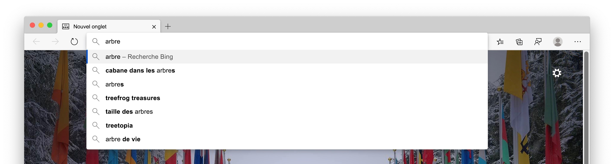
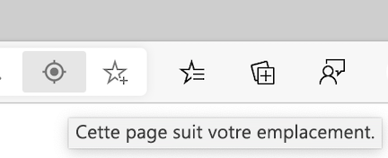
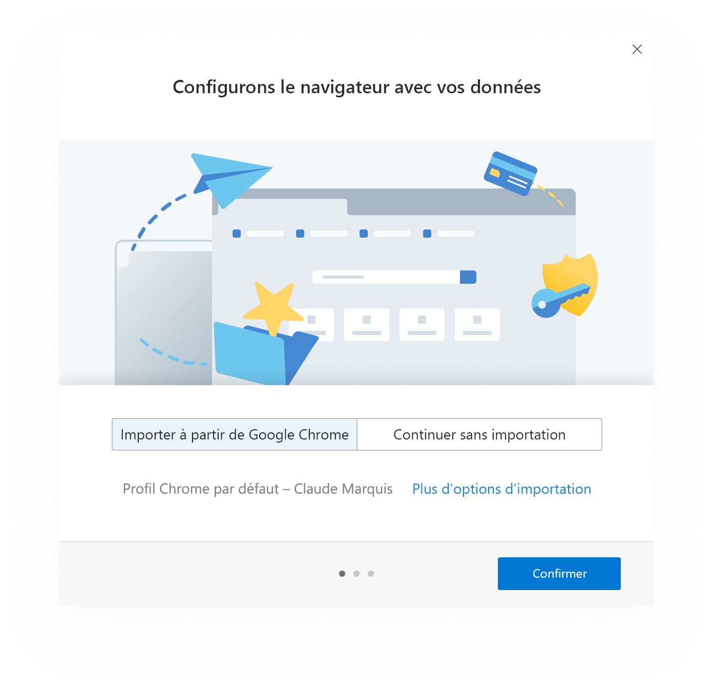
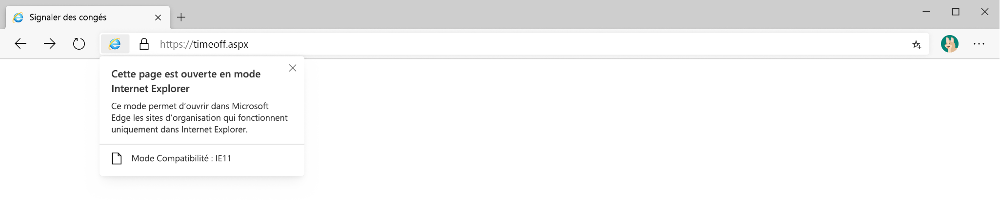
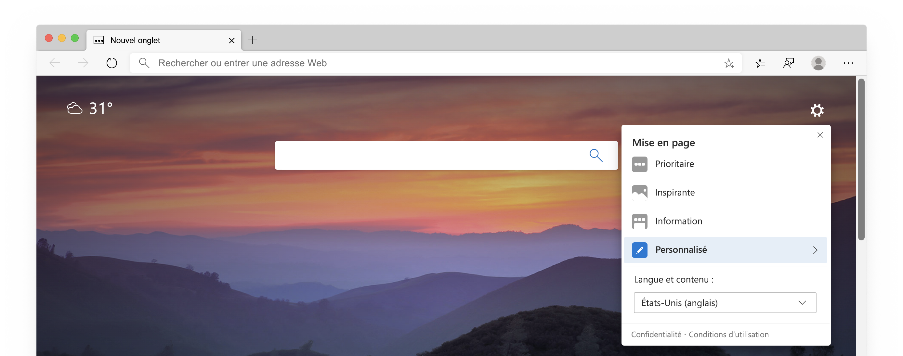
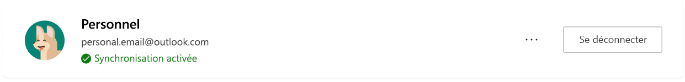

# Livre blanc sur la confidentialité MicrosoftEdge  

La promesse de confidentialité de votre navigateur est de vous offrir la protection, la transparence, le contrôle et le respect des attentes.  Pour faire en sorte que votre politique de confidentialité puisse être transformée en produits Microsoft, l’équipe Microsoft Edge a fourni un livre blanc sur la vie privée qui décrit le fonctionnement des fonctionnalités et des services Microsoft Edge et la façon dont chacun risque d’affecter votre vie privée.  L’objectif de l’équipe Microsoft Edge est de vous offrir une vision complète de l’utilisation de vos données, de savoir comment contrôler les différentes fonctionnalités et de gérer vos données collectées, de sorte que vous ayez les informations dont vous avez besoin pour prendre les bonnes décisions sur le respect de la vie privée.  

Dans certaines sections du papier, l’équipe Microsoft fournit les étapes nécessaires pour accéder aux paramètres de Microsoft Edge et aux autres pages.  Par souci de cohérence, l’équipe Microsoft Edge a utilisé un format raccourci dans le livre blanc: vous devez voir les `edge://` URL qui `edge://favorites` commencent `edge://settings/privacy`par par exemple ou.  Pour accéder aux pages, tapez le texte en gras directement dans la barre d’adresses Microsoft Edge.  Ces pages ne sont visibles que dans Microsoft Edge.  

Le livre blanc est axé sur la version de bureau de Microsoft Edge, et certaines parties du papier peuvent inclure des fonctionnalités ou des expériences qui ne sont pas disponibles pour tous les utilisateurs.  Par ailleurs, le livre blanc traite des fonctions et services qui existent dans le produit dès aujourd’hui, mais peuvent faire l’objet de modifications à l’avenir.  La préversion de la collecte de données de Microsoft Practices, ce qui signifie que vos données sont conservées pendant la durée minimale, mais les temps de rétention peuvent varier en fonction de la fonctionnalité ou du service utilisé et peut changer dans le temps.  

## Barre d’adresses et suggestions  

La barre d’adresses vous permet d’entrer les URL de site Web et de rechercher sur le Web.  Par défaut, la barre d’adresses fournit des suggestions de recherche et de site en utilisant les caractères que vous entrez.  Vous devriez voir des suggestions de vos favoris, de l’historique de navigation, des recherches précédentes et du fournisseur de recherche par défaut.  

  

Pour faciliter la navigation et la recherche, lorsque vous tapez dans la barre d’adresses, les caractères tapés sont envoyés à votre fournisseur de recherche par défaut afin que le fournisseur de recherche envoie des suggestions de recherche suggérées.  La barre d’adresses classe votre entrée en tant qu’URL, recherche ou inconnu.  Ces informations, ainsi que les suggestions que vous sélectionnez, la position de la sélection et les autres données de barre d’adresse, sont envoyées au fournisseur de recherche par défaut.  Si votre fournisseur de recherche est Bing, un identificateur Resettable unique à votre navigateur est envoyé avec ces données pour comprendre la requête de recherche et la session de requête.  D’autres identificateurs de service de suggestion automatique sont envoyés à votre moteur de recherche par défaut pour compléter les suggestions de recherche.  Votre adresse IP et les cookies sont envoyés à votre fournisseur de recherche par défaut pour améliorer la pertinence des résultats de la recherche.  Un signal est envoyé à votre fournisseur de recherche par défaut lorsque vous sélectionnez la barre d’adresse pour signaler le fournisseur et être prêt à proposer des suggestions.  Les caractères tapés et les requêtes de recherche ne sont pas envoyés à Microsoft sauf si votre fournisseur de recherche est Bing.  Ces données sont envoyées uniquement à votre fournisseur de recherche par défaut si vous avez activé les **suggestions de recherche et de site à l’aide de mon paramètre caractères entrés** .  La désactivation de cette fonctionnalité empêche les caractères tapés d’être envoyés au fournisseur de recherche par défaut.  Vos requêtes de recherche sont toujours envoyées à votre fournisseur de recherche par défaut pour fournir des résultats de recherche.  Si Microsoft Edge détecte que votre saisie dans la barre d’adresses peut contenir des informations sensibles, telles que des informations d’identification d’authentification, des noms de fichiers locaux ou des données d’URL qui sont généralement chiffrées, le texte tapé n’est pas envoyé.  Si vous avez **amélioré les produits Microsoft en envoyant des rapports d’incident et des données sur la manière dont vous utilisez le** paramètre de navigateur activé, Microsoft Edge collecte des données de diagnostic sur la barre d’adresse, comme le nombre de requêtes proposées, quel que soit votre fournisseur de recherche.  

Les séquences de touches et les sites Web que vous visitez sont stockés localement sur l’appareil par profil.  Vous pouvez supprimer ces données en `edge://settings/clearBrowserData`sélectionnant la case à cocher de l' **historique de navigation**et en sélectionnant **Effacer maintenant**.  Si Bing est votre fournisseur de recherche par défaut et que vous êtes connecté (e) à Bing, vous pouvez supprimer vos recherches via le [tableau de bord de confidentialité de Microsoft](https://account.microsoft.com/account/privacy?ref=privacy-edge-browse&ru=https%3A%2F%2Faccount.microsoft.com%2Fprivacy%2Fbrowse%3Fref%3Dprivacy-edge-browse&destrt=privacy-dashboard).  Vous pouvez supprimer l’historique de navigation `edge://history` de pour que les sites Web apparaissent sous forme de suggestions dans la barre d’adresses.  Sur Windows 10, il est possible que les fonctionnalités de la barre d’adresse et des suggestions de recherche soient effacées en accédant aux fonctionnalités de **démarrage** > **Settings** > des diagnostics de**confidentialité** > **\ & commentaires**et en sélectionnant **supprimer** sous **Supprimer les données de diagnostic**.  Toutes les autres données sont supprimées après 36 mois.  

Si vous êtes connecté à Microsoft Edge à l’aide d’un compte Microsoft ou scolaire et que Microsoft Search est disponible, un jeton anonyme représentant votre compte est envoyé avec la requête pour fournir des fonctionnalités spécifiques au compte, telles que des résultats spécifiques à votre entreprise.  

Toutes les données sont transmises en toute sécurité sur HTTPs.  S' [il s’agit de](https://bing.com) votre fournisseur de recherche par défaut, les résultats de recherche et de type sont enregistrés pendant 6 mois maximum.  

Si vous recherchez un mot unique dans la zone adresse, Microsoft Edge risque de l’envoyer à votre serveur DNS pour voir s’il correspond à un hôte de votre réseau et vous pouvez essayer de vous connecter à l’hôte correspondant.  Cette option vous permet d’accéder à cet hôte au lieu de rechercher.  Par exemple, si votre routeur est fourni par le `router` nom d’hôte `router` et que vous entrez dans la barre d’adresses, vous avez la `https://router/`possibilité de rechercher le mot ainsi que de rechercher `router` le mot avec votre fournisseur de recherche par défaut.  Cette fonctionnalité n’est pas gérée par les **suggestions de recherche et de site à l’aide du paramètre j’ai entré des caractères** dans la mesure où il n’implique pas l’envoi de données vers votre moteur de recherche par défaut.  

Vous pouvez désactiver l’option **afficher les suggestions de recherche et de site à l’aide** de votre paramètre de caractères tapés `edge://settings/search`et changer le moteur de recherche par défaut dans.  Lorsque vous naviguez dans un mode de navigation InPrivate ou en mode invité, les suggestions sont désactivées.  InPrivate affiche les suggestions de votre navigation locale, telles que l’historique de navigation ou les recherches passées, mais aucun caractère tapé n’est envoyé à votre moteur de recherche par défaut.  Le mode invité n’affiche aucune suggestion ou n’envoie aucun caractère tapé à votre moteur de recherche par défaut.  

Les données collectées par d’autres fournisseurs de recherche suivent la politique de confidentialité de leur société.  

## Recopie incrémentée  

La recopie incrémentée dans Microsoft Edge vous permet d’être plus productif en vous permettant d’enregistrer les mots de passe, les informations de paiement, les adresses et d’autres données d’entrée de formulaire.  Lorsque vous accédez à un site et commencez à remplir un formulaire, Microsoft Edge utilise les informations de remplissage de formulaire correspondant aux données de recopie incrémentée enregistrées dans le formulaire.  Microsoft Edge fournit des données d’entrée de formulaire que vous avez enregistrées précédemment lorsque vous rencontrez des formulaires similaires.  Les mots de passe et les informations de carte bancaire sont enregistrés uniquement avec votre autorisation explicite pour chaque mot de passe et carte.  

Les adresses et d’autres entrées de formulaire sont enregistrées par défaut.  Toutefois, vous pouvez désactiver l’enregistrement et la recopie automatique de l’adresse et des `edge://settings/addresses`autres données de formulaire.  

Ne pas que Microsoft Edge vous invite à enregistrer les mots de passe en désactivant le paramètre **proposer d’enregistrer** les `edge://settings/passwords`mots de passe dans.  Si vous ne souhaitez pas que Microsoft Edge effectue une copie automatique des mots de passe enregistrés existants, vous pouvez supprimer les `edge://settings/passwords` mots de passe enregistrés dans pour supprimer toutes les données de la recopie incrémentée, accédez au paramètre **effacer les données de navigation** dans les paramètres de confidentialité et services Microsoft Edge.  Sélectionnez **remplir automatiquement les données du formulaire**, la plage de dates de votre choix, puis **désactivez**l’option maintenant.  

Si vous avez activé la synchronisation de votre profil, vos données de remplissage automatique sont synchronisées dans toutes les versions de Microsoft Edge dans lesquelles vous êtes connecté aux mêmes informations d’identification.  Lorsque la synchronisation est activée, toutes les données de la recopie incrémentée sont stockées sur des serveurs Microsoft chiffrés.  Les données de remplissage automatique stockées sur des serveurs Microsoft sont uniquement utilisées à des fins de synchronisation.  Vous pouvez désactiver la synchronisation de vos données de recopie incrémentée `edge://settings/profiles/sync`.  Si vous avez activé la synchronisation pour la recopie incrémentée, la suppression des données de la recopie incrémentée d’un appareil sur lequel vous êtes connecté à Microsoft Edge entraîne la suppression des données de la recopie incrémentée d’autres appareils dans lesquels vous êtes connecté.  

Lorsque vous accédez à une page Web et envoyez un formulaire, Microsoft Edge envoie des informations sur le formulaire (par exemple, un hachage du nom d’hôte et du type de saisie semi-automatique) (par exemple, la case 1 recherche une adresse de messagerie), la zone 2 recherche un mot de passe, etc.  Aucune information entrée par l’utilisateur ou identificateur d’utilisateur n’est envoyé au service.  Ces informations permettent à Microsoft Edge d’identifier correctement les formulaires sur différentes pages Web.  Ces données sont utilisées pour vous aider à trouver les données de recopie incrémentée enregistrées dans le formulaire.  

Lorsque vous utilisez le mode invité, la recopie incrémentée n’est pas disponible et les nouvelles entrées de la recopie incrémentée ne sont pas ajoutées.  Lorsque vous effectuez une recherche sur non privée, Microsoft Edge propose des entrées de recopie incrémentée, mais les nouvelles entrées de recopie incrémentée ne sont pas ajoutées.  

## Cast  

Le cast de Microsoft Edge vous permet d’afficher vos éléments multimédias sur un autre écran avec Google cast.  Vous pouvez accéder à cette fonctionnalité à partir des **paramètres et plus encore (...)**  >  **Autres outils** > **diffuser du contenu multimédia sur un appareil**.  La conversion n’utilise pas Microsoft ou Google services. 

## Collections  

Vous pouvez récupérer des sites, du texte et des images sur le Web et organiser le contenu à l’aide de collections dans Microsoft Edge.  Toutes les données de collection sont stockées localement sur l’appareil et organisées par profil Microsoft Edge.  Si la synchronisation est activée pour les collections, vos collections créées, y compris les notes ou les commentaires, sont disponibles dans toutes les versions de Microsoft Edge connectées et synchronisées.  

Toutes les 24 heures, Microsoft Edge télécharge une liste de sites pris en charge pour lesquels il existe des modèles d’extraction d’entité spéciaux.  Les modèles sont spécifiques à chaque site Web.  Lorsque vous créez un nouvel élément dans votre collection, Microsoft Edge vérifie que le site à partir duquel vous créez le nouvel élément de collection figure dans la liste des sites pris en charge.  Si le site figure dans la liste, Microsoft Edge envoie une commande ping au service d’extraction d’entité pour le modèle de sites spécifique.  Aucun identificateur d’utilisateur n’est associé à cette demande au service.  Ce modèle tente d’identifier le nom, le prix, les évaluations, l’image principale et d’autres données relatives à l’élément qui est collecté.  Si le site à partir duquel vous créez un nouvel élément de collection n’est pas sur le site de liste pris en charge, Microsoft Edge ne télécharge pas de modèle.  Les modèles permettent de créer tous les éléments de collection localement sur l’appareil.  Aucune donnée sur les éléments de collection n’est envoyée au service pour créer la collection.  

Les modèles stockés sur l’appareil sont supprimés en effaçant les données du cache sous le paramètre effacer les données `edge://settings/privacy`de **navigation** dans.  

Les collections ne sont pas disponibles lorsque vous utilisez la navigation InPrivate ou le mode invité.  

## Se  

Si des données de diagnostic facultatives, y compris les rapports d’incident sont activés, Microsoft collecte des données de diagnostic lorsque Microsoft Edge se bloque ou rencontre d’autres problèmes de fiabilité.  Ces données de diagnostic permettent de diagnostiquer et résoudre les problèmes de fiabilité liés à Microsoft Edge et aux autres produits et services Microsoft.  

  

Les données de diagnostic collectées sous la forme de vidages sur incident, qui contiennent l’état de l’appareil et du logiciel capturées au moment où Microsoft Edge rencontre le problème de fiabilité.  Le vidage sur incident contient des informations sur ce qui se passe au moment du problème de fiabilité.  Des informations telles que le site Web que vous avez visité lors du blocage ou l’utilisation de votre UC pourront figurer dans ces données de diagnostic.  Les données de diagnostic de blocage sont stockées localement sur l’appareil et envoyées à Microsoft par le biais d’une liaison chiffrée lorsque le signalement d’incident est activé.  Chaque vidage sur incident contient un identificateur unique pour votre appareil, un identificateur Resettable unique à votre navigateur et des données de diagnostic supplémentaires (par exemple, URL, utilisation de l’UC et utilisation du réseau) pour vous aider à identifier le problème.  Ce type de données supplémentaire de diagnostic est associé au vidage sur incident pour vous aider à diagnostiquer le problème de fiabilité, par exemple pour savoir combien de périphériques rencontrent le problème et la gravité.  

Les vidages sur incident sont envoyés à Microsoft et stockés sur des serveurs Microsoft sécurisés pendant 30 jours avant d’être supprimés.  Demandez à supprimer ces données de diagnostic sur les appareils Windows 10 en accédant à l’écran de **démarrage** > **paramètres** > des diagnostics de**confidentialité** > **\ & commentaires** et en sélectionnant **supprimer** sous le paramètre **Supprimer les données de diagnostic** .  Les informations de blocage agrégées telles que le nombre de types de blocages qui se produisent sont stockés à des fins de création de rapports et d’amélioration du produit.  

Il est possible d’effacer les données de diagnostic de blocage stockées localement sur l’appareil `edge://crashes`à partir du système de fichiers.  

Pour désactiver la collecte des données de diagnostic sur incident sur Windows 10, accédez à **Diagnostics \ & commentaires** dans les diagnostics windows \ & paramètres de commentaires.  Pour les versions de Microsoft Edge sur toutes les autres plateformes `edge://settings/privacy` , voir et désactiver l’option améliorer les **produits Microsoft en envoyant des rapports d’incident et des données sur l’utilisation du paramètre de navigateur** .  Cette collecte des données de diagnostic est également susceptible d’être désactivée pour les entreprises via des [stratégies de groupe gérées par votre organisation](/deployedge/microsoft-edge-privacy-policy).  

## Données de diagnostic relatives à l’utilisation du navigateur  

Microsoft utilise des données de diagnostic pour améliorer nos produits et services, maintenir la sécurité de nos produits et nous aider à mieux comprendre le fonctionnement de nos produits.Chaque fois que l’équipe Microsoft Edge recueille des données, la décision est vérifiée comme bon choix pour vous.  Microsoft est convaincu de la réduction de la collecte d’informations et pratiques.  L’équipe Microsoft Edge s’efforce de rassembler uniquement les informations nécessaires et est stockée uniquement tant que nécessaire pour améliorer les produits et services Microsoft.  

À mesure que vous utilisez les fonctionnalités et services dans Microsoft Edge et d’autres applications qui utilisent la plateforme Web Microsoft Edge, des données de diagnostic sur la façon dont vous utilisez ces fonctionnalités sont envoyées à Microsoft.  Ces données de diagnostic incluent des informations telles que votre installation de Microsoft Edge, de l’utilisation des fonctionnalités, des performances et de l’utilisation de la mémoire.  Par exemple, si vous avez préféré un site Web, l’équipe Microsoft Edge reçoit des informations indiquant que le bouton favori a été cliqué et qu’un favori a bien été ajouté, mais pas quel site n’est défini comme favori.  Ces données de diagnostic incluent également des informations de performance, comme le nombre de millisecondes nécessaires à l’ouverture d’un nouvel onglet.  Les fonctionnalités et services mentionnés dans ce livre blanc collectent des données de diagnostic.  

  

Par ailleurs, Microsoft Edge rassemble un ensemble de données de diagnostic requises nécessaires pour que le produit soit à jour, sécurisé et fonctionne correctement.  Cela inclut la connectivité de l’appareil et les informations de configuration concernant le paramètre de consentement de la collection de données actuel, la version de l’application et l’état de l’installation.  Cela ne peut être désactivé qu’avec des stratégies de groupe gérées par votre organisation.  [En savoir plus sur les données de diagnostic au sein de votre organisation](/windows/privacy/configure-windows-diagnostic-data-in-your-organization).  

Microsoft Edge génère ces données de diagnostic, les stocke en local et les envoie périodiquement à Microsoft.  Les données de diagnostic sont envoyées via HTTPs et stockées sur des serveurs Microsoft.  Ces données de diagnostic sont associées à un identificateur unique à votre appareil et à un identificateur Resettable unique à votre navigateur.  Les identificateurs ne contiennent pas vos informations personnelles.  **Pour réinitialiser** l’identificateur unique de votre navigateur sur les appareils Windows 10, accédez à l’écran de **démarrage** > **paramètres** > des diagnostics de**confidentialité** > **\ & commentaires** , puis sélectionnez **supprimer** sous le paramètre supprimer les données de **diagnostic** ou changer votre paramètre sous **données de diagnostic** en **standard**.  Sur d’autres plateformes, l’identificateur Resettable unique à votre navigateur est régénéré chaque fois que vous modifiez l’option **améliorer les produits Microsoft en envoyant des données sur la manière dont vous utilisez le** paramètre de navigateur dans `edge://settings/privacy` de **sur** **de.**  Cette fonctionnalité de réinitialisation risque de différer selon les appareils gérés par votre organisation.  

Si vous utilisez Windows 10 version 1803 \ (mise à jour d’avril 2018) ou une version ultérieure, vous pouvez afficher les données de produit partagées avec Microsoft dans la visionneuse **des données de** diagnostic en accédant à l'**Settings** > **Privacy** >  **écran** de **&** **démarrage** > .  

Pour les autres plateformes ou versions de Windows 10 inférieures à la version 1803 `edge://data-viewer` , accédez à l’affichage de ces données de diagnostic.  Les données sont envoyées à Microsoft périodiquement `edge://data-viewer` et affiche uniquement les données qui ont été envoyées à Microsoft depuis la dernière ouverture de la visionneuse.  Vous devrez peut-être actualiser la visionneuse pour afficher les données envoyées à Microsoft pour votre session donnée.  Les données utilisées pour remplir `edge://data-viewer` sont stockées localement sur l’appareil.  Pour effacer ces données dans la visionneuse, il vous `edge://data-viewer` suffit de fermer l’onglet.  

Les données de diagnostic sont stockées sur des serveurs Microsoft pendant 18 mois.  Sur Windows 10, vous pouvez supprimer les données de diagnostic en accédant à l’option de **démarrage** > **Settings** > des diagnostics de**confidentialité** > **\ & commentaires** et en sélectionnant **supprimer** sous le paramètre **Supprimer les données de diagnostic** .  La fonctionnalité de suppression des données de diagnostic est uniquement prise en charge sur Windows 10, mise à jour 2018 d’avril et version ultérieure.  Pour plus d’informations, voir [Diagnostics, commentaires et confidentialité dans Windows 10](https://support.microsoft.com/help/4468236/diagnostics-feedback-and-privacy-in-windows-10-microsoft-privacy).  

Pour Microsoft Edge sur Windows 10, ce paramètre est déterminé par votre paramètre de données de diagnostic Windows.  Cela se répercute dans les paramètres de confidentialité et de services Microsoft Edge.  Pour modifier ces paramètres Windows, accédez à**paramètres** > de **démarrage** > de l’outil Diagnostics de**confidentialité** > **\ & commentaires**.  Sur tous les autres canaux et plates-formes, vous pouvez contrôler cette `edge://settings/privacy` collection de données de diagnostic dans et activer ou désactiver l’option **améliorer les produits Microsoft en envoyant des rapports d’incident et des données sur la manière dont vous utilisez le paramètre de navigateur** .  Ce paramètre est identique pour tous les profils associés à l’installation de Microsoft Edge sur votre appareil.  Ce paramètre n’est pas synchronisé sur tous vos appareils.  Le paramètre s’applique à la navigation InPrivate et au mode Invité.  Si votre appareil est géré à l’aide de stratégies de groupe définies par votre organisation, `edge://settings/privacy`cette opération est répercutée dans.  

## Gestion des droits numériques et licences multimédias  

Lorsqu’un site Web propose du contenu multimédia protégé par la gestion des droits numériques (DRM), Microsoft Edge utilise un pipeline de lecture sécurisé pour vérifier que le contenu n’est pas copié ou utilisé de manière incorrecte.  Dans le cadre de cette fonctionnalité, Microsoft Edge risque de stocker des données liées à la gestion des droits numériques sur votre appareil, y compris un identificateur unique et des licences multimédias, et de transmettre cet identificateur unique à un serveur de licences multimédia spécifié par le fournisseur de contenu.  Lorsque vous utilisez le site Web, Microsoft Edge récupère les informations DRM pour vérifier que vous êtes autorisé à utiliser le contenu.  Ces données permettent de valider l’accès au contenu protégé et de garantir une interface multimédia transparente.  

Microsoft Edge prend en charge la gestion des droits numériques par le biais de l’API d’extensions multimédias chiffrées (API Encrypted) pour les sites HTML5.  L’API Encrypted permet aux sites Web de communiquer avec un fournisseur de services de gestion des droits numériques appelé module de déchiffrement de contenu (CDM \).  Différents systèmes DRM tels que Widevine par Google ou PlayReady par Microsoft, pourront être pris en charge par leur propre implémentation de CDM.  Les fournisseurs de contenu peuvent opter pour la prise en charge d’un ou plusieurs systèmes DRM potentiels et peuvent utiliser les fonctionnalités de l’API Encrypted pour déterminer le système DRM à utiliser pour un client spécifique.  [En savoir plus sur la confidentialité de Encrypted](https://w3.org/TR/encrypted-media/#privacy).  

Microsoft Edge prend en charge la gestion des droits numériques par PlayReady uniquement sur Windows 10.  PlayReady est une implémentation DRM permettant de réaliser des expériences multimédias comme la vidéo 4 k et le son Dolby Atmos.  Microsoft Edge utilise les API Windows Media Foundation pour la prise en charge de PlayReady.  Pour valider l’accès au contenu protégé, Microsoft Edge utilise le système d’exploitation Windows 10 qui utilise un identificateur unique et le communique avec le service PlayReady.  Toutes les données de Encrypted, CDM et de navigateur pour PlayReady qui persistent sur l’appareil sont stockées et conservées sur Microsoft Edge.  [En savoir plus sur PlayReady](/playready/overview/simple-end-to-end-system).  

Microsoft Edge prend en charge Widevine par Google DRM et cette option est activée par défaut.  Microsoft Edge récupère périodiquement les mises à jour de Widevine à partir de Google Server.  L’utilisation de Widevine peuvent inclure des communications sur Google.  Les utilisateurs peuvent refuser l’utilisation de Widevine dans Microsoft Edge en désactivant l’indicateur de DRM Widevine `edge://flags/#edge-widevine-drm`dans.  Widevine a la possibilité de créer un identificateur d’appareil unique et de le transmettre à Google.  Pour plus d’informations sur Widevine et la confidentialité, voir la politique de confidentialité de Google.  

Microsoft Edge prend en charge la gestion des droits numériques dans Adobe, qui est utilisée par certains sites au lieu de HTML5.  Vous devez autoriser l’autorisation d’Adobe Flash lorsqu’un site le demande.  Lorsqu’un site utilise la gestion des droits numériques (DRM) par Adobe, Microsoft Edge vous permet d’accéder à Adobe Access à un identificateur d’appareil unique.  Vous pouvez effacer et réinitialiser toutes les instances stockées localement de cet identificateur `edge://settings/privacy`.  Sous **effacer les données de navigation**, sélectionnez **choisir les données à effacer**, activez la case à cocher **cookies et autres données du site**, puis sélectionnez **Effacer maintenant** pour supprimer les identificateurs stockés.  Ne l’utilisez pas dans `edge://settings/content/flash`le logiciel Adobe Flash DRM.  

Lorsque vous demandez l’accès à des éléments multimédias HTML5 chiffrés comme une vidéo en ligne, Microsoft Edge crée une demande de licence pour déchiffrer le média.  La CDM utilisée crée la demande de licence contenant un ID de requête.  Cette demande est envoyée sur le serveur de licences.  Il n’y a aucune partie de la demande de licence et aucune information d’identification personnelle n’est stockée sur l’appareil.  

Lors du retour de la licence multimédia, un identificateur multimédia est créé, qui est unique pour l’utilisateur et le site.  Cet ID n’est pas partagé entre les sites et est différent pour chaque site.  Un ID de session, utilisé pour identifier une session de lecture, est envoyé avec l’identificateur multimédia pour déchiffrer le média.  L’identificateur multimédia est stocké localement sur l’appareil et peut être stocké avec le fournisseur de contenu.  

Toutes les protections DRM et de contenu sont susceptibles d' `edge://settings/content/protectedContent`être désactivées.  

- La désactivation de l’option **autoriser les sites à lire du contenu protégé** désactive la lecture de systèmes DRM basés sur la gestion des droits numériques (par exemple, PlayReady et Widevine), mais pas pour les systèmes non-CDM tels que la gestion des droits numériques (DRM).  Le flash est géré par une autorisation de site `edge://settings/content/flash`séparée dans.  La désactivation de ce paramètre a pour effet que la fonctionnalité multimédia ne fonctionne pas correctement.  
- La désactivation du paramètre **autoriser les identificateurs pour le contenu protégé** empêche la création d’identificateurs pour la gestion des droits numériques dans la gestion des droits relatifs à l’accès par le biais de Google.  Il est possible que certaines fonctionnalités multimédias ne fonctionnent pas correctement sur certains sites.  

## Ne pas suivre  

Lorsque vous activez le paramètre **Envoyer les demandes «ne pas suivre»** `edge://settings/privacy`, Microsoft Edge envoie un en-tête DNT: 1 en-tête HTTP avec vos demandes de trafic sortant, HTTPS et SPDY aux sites Web que vous visitez pour demander à n’utiliser aucun suivi.  Toutefois, l’activation du paramètre **Envoyer des demandes «ne pas suivre»** ne garantit pas que les sites Web ne peuvent pas vous suivre.  Certains sites peuvent respecter cette demande en affichant des publicités non basées sur une navigation antérieure.  Microsoft Edge n’a pas le contrôle si cette requête est honorée ou non.  Pour éviter que des sites Web vous entrainent **Tracking prevention** , définissez le paramètre `edge://settings/privacy` de prévention de suivi sur **équilibré** ou **strict**.  

Lorsque vous utilisez le mode invité, Microsoft Edge n’envoie pas de demandes «do not Track».  Lorsque vous utilisez la navigation InPrivate, Microsoft Edge envoie uniquement les demandes «do not Track» si le paramètre **Send «do not Track»** est activé pour le profil que vous utilisez.  

## Téléchargements  

Microsoft Edge vous permet de télécharger des fichiers en toute sécurité.  Vous pouvez choisir l’emplacement dans `edge://settings/downloads`lequel les fichiers sont téléchargés sur votre appareil.  Si SmartScreen est activé, les informations relatives à votre fichier, telles que le nom de fichier et l’URL, sont envoyées à SmartScreen pour vérifier la réputation du fichier.  Cela vous permet d’éviter de télécharger accidentellement un logiciel malveillant connu connu comme ayant un impact sur votre appareil.  Vous pouvez activer ou désactiver le mode SmartScreen `edge://settings/privacy`dans.  [En savoir plus sur le SmartScreen](#smartscreen).  

Un historique de vos anciens téléchargements est susceptible d’être `edge://downloads`affiché dans.  Il est possible d’effacer `edge://settings/clearBrowserData` les données de votre navigation pour pouvoir supprimer vos données de navigation, y compris l’historique de téléchargement.  La suppression de votre historique de téléchargement à partir de Microsoft Edge ne supprime pas les fichiers de votre appareil.  La suppression de fichiers téléchargés à partir de votre appareil ne supprime pas les fichiers de l’historique de téléchargement.  Lorsque vous utilisez la navigation InPrivate ou le mode invité, l’historique des téléchargements de cette session est effacé lorsque vous fermez les fenêtres non privées ou invitées, mais les fichiers sont enregistrés sur l’appareil.  

## Extensions et modules complémentaires Microsoft Edge  

Vous pouvez installer des extensions dans Microsoft Edge pour ajouter des fonctionnalités au navigateur.  Lorsque vous installez une extension à partir des modules complémentaires Microsoft Edge ou d’un autre magasin d’extensions, Microsoft collecte des informations sur les extensions pour aider les développeurs et Microsoft à comprendre la façon dont chacun d’eux est utilisé.  Microsoft Edge rassemble les données agrégées, y compris le nombre de fois qu’une extension a été téléchargée et des informations sur son fonctionnement, telles que les données d’incident.  Microsoft partage ces données agrégées avec les développeurs des extensions.  Les commentaires et avis des utilisateurs sont publics sur le Windows Store et sont également partagés avec les développeurs.  Si vous êtes connecté à Microsoft Edge, les demandes d’installation d’extensions contiennent des cookies et l’installation est associée à votre compte.  Ces données sont utilisées en agrégation pour comprendre la popularité des extensions.  

Si vous avez activé la synchronisation pour les extensions dans les paramètres de votre profil, vos extensions et préférences pour ces extensions sont synchronisées dans toutes les versions de synchronisation de Microsoft Edge connectées.  

L’installation d’extensions est facultative, et toutes les extensions pourront être désinstallées à `edge://extensions`tout moment dans.  Les extensions sont mises à jour à l’aide du service Microsoft Edge Update qui envoie une liste des extensions installées au service de mise à jour pour vérifier si une mise à jour est disponible.  Lors de l’installation d’une extension, les extensions spécifient les données utilisateur nécessaires à l’accès et Microsoft Edge vous demande votre consentement avant d’installer cette extension.  Assurez-vous toujours qu’une extension est crédible et sure avant de l’installer, et examinez la politique de confidentialité de cette extension fournie par le développeur.  

## Contrôle parental  

Microsoft propose un certain nombre d’outils permettant de rester connecté et de renforcer la sécurité des enfants sur les appareils Windows 10, Xbox et Android exécutant le lanceur Microsoft.  

Au sein d’un groupe de famille, il existe des paramètres de famille qui doivent être activés pour les enfants utilisant Microsoft Edge.  L’organisateur du groupe de famille doit activer ces paramètres pour les utilisateurs du groupe.  Les trois principales fonctionnalités proposées au groupe famille sont le filtrage Web, le rapport d’activité et la recherche sécurisée.  

Le filtrage Web protège les enfants dans le groupe famille contre le passage d’un site Web ou d’un site Web mature en particulier par l’organisateur de la famille.  

Rapports sur l’activité: enregistre des informations sur les sites Web visités, ainsi que les recherches, le temps d’écran, les appareils utilisés et les tentatives de consultation des sites bloqués.  L’organisateur du groupe de la famille pourra voir les informations sur [Family.Microsoft.com](https://family.microsoft.com).  Ces données sont collectées et chiffrées en transit et envoyées à Microsoft et stockées sur des serveurs de stockage Microsoft sécurisés.  Ces données sont collectées avec le compte Microsoft de l’enfant pour qu’il puisse être géré.  Les rapports d’activité sont stockés sur [Family.Microsoft.com](https://family.microsoft.com) pendant 30 jours avant d’être supprimés.  

La recherche sécurisée ajoute un mot clé sécurisé à la demande d’en-tête pour rechercher des moteurs.  Bing lit ce mot clé et filtre les résultats de recherche renvoyés à l’enfant.  D’autres moteurs de recherche pourront également retourner des résultats filtrés en raison de ce mot clé.  Toutes les recherches de l’enfant sont collectées et créées et disponibles pour que l’organisateur de la famille les affiche dans les rapports d’activité ou sur [Family.Microsoft.com](https://family.microsoft.com).  Ces données sont collectées avec le compte Microsoft de l’enfant pour qu’il puisse être correctement géré.  

Les données de navigation de l’enfant sont stockées sur des serveurs sécurisés Microsoft et mis à la disposition des parents pendant 30 jours avant d’être supprimés immédiatement.  Ces données risquent d’être supprimées à tout moment à partir du [tableau de bord de confidentialité de Microsoft](https://account.microsoft.com/account/privacy).  La navigation dans les données stockées localement sur un appareil doit être évidente dans l' `edge://settings/clearBrowserData`exploration des données de Microsoft Edge.  

L’enfant doit être connecté à Windows 10 à l’aide de son compte Microsoft, et le paramètre de création de rapports d’activité doit être activé par l’organisateur de la famille pour que ces données puissent être collectées et partagées avec l’organisateur du groupe.  L’enfant n’a pas besoin d’être connecté à Microsoft Edge pour que ces données puissent être collectées.  Si les fonctionnalités de sécurité parentales ne sont pas disponibles dans votre version de Windows 10, vous pouvez effectuer une mise à jour vers la version la plus récente de Windows afin d’accéder à ces fonctionnalités.  

Le mode invité et la navigation InPrivate sont désactivés si les filtres Web ou les rapports d’activité sont activés.  

L’organisateur de groupe de la famille risque d’arrêter cette collection de données du portail de contrôle parental.  [En savoir plus sur les fonctionnalités de contrôle parental de Microsoft](https://support.microsoft.com/help/12413/microsoft-account-what-is-family-group).  

## Commentaires  

L’équipe Microsoft Edge est toujours à l’écoute de vos clients et à évaluer votre avis.  Pour envoyer des commentaires dans Microsoft Edge, sélectionnez les **paramètres et plus** > **d’aide et de commentaires** > **Envoyer des commentaires**.  Pour les applications Web progressives \ (PWA \), sélectionnez les **paramètres et plus encore...**  >  **Envoyer des commentaires à Microsoft**.  Vous devez fournir des informations sur les commentaires, mais toutes les autres informations sont facultatives.  Si un e-mail est détecté à partir de votre profil Microsoft Edge, il est déjà rempli avec l’URL actuelle du site sur lequel vous vous trouvez et les données de diagnostic pertinentes.  Les données de diagnostic peuvent inclure des données sur les fonctionnalités activées et votre utilisation du navigateur.  Il est également possible d’inclure une capture d’écran, un fichier de votre appareil et un enregistrement de votre navigateur.  L’enregistrement supplémentaire facultatif que vous fournissez est susceptible de contenir des informations d’identification personnelle.  Ces données sont utilisées uniquement à des fins de diagnostic et d’amélioration du produit.  

Les commentaires des utilisateurs sont envoyés en toute sécurité à Microsoft via HTTPs et stockés sur des serveurs Microsoft sécurisés.  Si vous incluez votre adresse de messagerie et que vous voulez **améliorer les produits Microsoft en envoyant des rapports d’incident et des données sur la manière dont vous utilisez le** paramètre de navigateur dans les paramètres de confidentialité de Microsoft Edge, un identificateur unique à l’installation de votre navigateur sur votre appareil est associé à vos commentaires.  Les données de diagnostic, y compris les journaux de diagnostic, les enregistrements et les pièces jointes sont stockés pendant 30 jours maximum.  Les données de retour restantes, y compris une capture d’écran facultative, sont stockées dans un délai de 15 mois.  Effectuez une [demande](https://www.microsoft.com/concern/privacy) de suppression de votre avis si vous avez fourni un e-mail contenant votre élément de commentaires.  

## Géolocalisation  

Microsoft Edge prend en charge l' [API de géolocalisation](https://w3.org/TR/geolocation-api), qui permet aux sites Web d’accéder à vos informations d’emplacement avec votre autorisation.  Il est possible que les sites Web vous demandent votre emplacement, par exemple, lorsque vous tentez de trouver le cybercafé de votre toilettes.  Microsoft Edge demande toujours votre autorisation avant d’accorder l’accès à des sites Web à votre emplacement.  Pour gérer cette autorisation ou pour interdire l’accès des sites à votre emplacement, accédez à `edge://settings/content/location`.  

Sur le côté droit de la barre d’adresses, Microsoft Edge indique lorsque votre emplacement est ou n’est pas partagé.  

  

Si vous autorisez le partage de votre emplacement avec un site, Microsoft Edge envoie des informations réseau locales telles que votre adresse IP et des points d’accès Wi-Fi proches au service de localisation Microsoft.  Le service Microsoft utilise ces informations pour évaluer vos coordonnées géographiques.  Cette estimation géographique est alors partagée avec le site avec lequel vous avez accepté de partager votre emplacement.  Sur Windows 10, Microsoft Edge utilise uniquement le service de localisation Microsoft si vous avez activé votre [paramètre d’emplacement Windows](https://support.microsoft.com/help/4468240/windows-10-location-service-and-privacy).  

Un nouvel ID généré de manière aléatoire est utilisé lors de l’exécution de requêtes au service de localisation Microsoft.  Le service d’emplacement Microsoft Edge n’enregistre pas vos coordonnées géographiques pour une période donnée.  

La navigation InPrivate utilise le paramètre d’autorisation d’emplacement du profil à partir duquel la session non privée a été lancée.  Le mode invité vous demande toujours d’avoir une autorisation avant d’accorder votre emplacement au site.  

## Importer les données d’un navigateur  

Microsoft Edge offre une utilisation interactive et transparente lorsque vous lancez le navigateur pour la première fois.  Dans le cadre de cette procédure, vous avez la possibilité d’importer les données de votre navigateur dans Microsoft Edge à partir d’un autre navigateur.  Lors de l’importation, vous pouvez conserver ou supprimer vos données importées et commencer à nouveau.  Ces données incluent vos favoris, l’historique de navigation, les données de recopie incrémentée, les extensions, les paramètres et d’autres données de navigation.  Les données de votre navigation issues d’anciennes versions de Microsoft Edge sont automatiquement incluses lors de la mise à jour vers le nouveau Microsoft Edge.  Avec votre confirmation, Microsoft Edge importe les données du navigateur à partir d’autres navigateurs, tels que Google Chrome, Mozilla Firefox et Internet Explorer, en fonction de votre navigateur le plus utilisé défini par votre système d’exploitation.  L’importation de vos données est effectuée en local sur votre appareil, stocké localement et n’est pas envoyé à Microsoft sauf si vous vous engagez à synchroniser vos données de navigation.  

  

Lorsque vous importez vos extensions à partir d’un autre navigateur tel que Google Chrome, Microsoft Edge importe une copie locale et demande une autorisation avant qu’elle ne soit activée.  Les autorisations de certaines extensions peuvent avoir changé.  Pour consulter les autorisations d’extension, accédez `edge://extensions`à.  

Vous pouvez décider d’importer des données à partir d’un autre navigateur `edge://settings/importData`à tout moment dans.  

## Installer et mettre à jour  

Vous pouvez télécharger et installer Microsoft Edge sur une plate-forme telle que Windows et macOS.  Microsoft Edge utilise le service de mise à jour pour assurer la sécurité et la mise à jour de votre version de Microsoft Edge.  

Lorsque vous téléchargez et installez Microsoft Edge, des informations sur votre appareil, comme votre canal de publication, des informations de base sur le matériel, des identificateurs de mise à jour, un identificateur unique sur votre appareil et un identificateur Resettable unique à votre navigateur sont envoyés à Microsoft pendant le processus d’installation.  L’adresse IP de l’appareil est envoyée au service de mise à jour, mais le dernier nombre de décimales est nettoyé pour les protections de confidentialité supplémentaires.  Lors de chaque session de navigation, un jeton généré récemment est créé pour installer les versions mises à jour de Microsoft Edge.  Le jeton n’est associé à aucune information personnelle et est utilisé uniquement pour le processus d’installation et de mise à jour et pour améliorer le service de mise à jour.  

Microsoft Edge effectue un test ping sur le service de mise à jour de Microsoft Edge à propos des étapes d’installation et de mise à jour.  En cas d’échec d’une installation ou d’une mise à jour et que le signalement d’incident est activé, un journal est créé et envoyé à Microsoft.  [En savoir plus sur l’envoi de rapports d’incident à Microsoft](#crashes).  Microsoft recueille des informations sur la façon dont vous avez téléchargé Microsoft Edge, le succès de l’installation, ainsi que les désinstallations pour mieux comprendre le succès des téléchargements Microsoft Edge.  

Les mises à jour automatiques sont activées par défaut pour tous les utilisateurs de Microsoft Edge.  Sur toutes les plateformes, Microsoft Edge vérifie les mises à jour au démarrage et périodiquement en cours d’exécution.  Sur les appareils MacOS, Microsoft AutoUpdate vérifie régulièrement les mises à jour pour les produits Microsoft.  Des contrôles et configurations supplémentaires sont disponibles pour les organisations.  [En savoir plus sur les contrôles et configurations supplémentaires](/deployedge/microsoft-edge-update-policies#update).  

## Mode InternetExplorer  

Microsoft Edge offre une interface simplifiée grâce à l’intégration d’Internet Explorer.  Microsoft Edge ne prend en charge que le mode IE 11 et IE et n’est disponible que sur Windows.  Cette fonctionnalité est disponible pour les organisations via une stratégie de groupe.  L’administrateur sélectionne une liste de sites à ouvrir dans le mode IE dans Microsoft Edge.  

  

Microsoft Edge télécharge la liste des sites à partir d’un emplacement défini par l’administrateur par le biais d’une stratégie, et met en cache le fichier pour déterminer les sites qui doivent être ouverts dans le mode IE.  En fonction des paramètres de Windows ou d’Internet Explorer 11, Microsoft Edge collecte des données de diagnostic relatives à l’utilisation du mode IE (par exemple, sites auxquels les utilisateurs ont accès, données de performance, données de fiabilité et données d’utilisation des fonctionnalités).  Sur Windows 10, les données de diagnostic sont collectées conformément à vos paramètres de données de diagnostic Windows.  Dans Windows 8,1, les informations de site Web sont collectées si l’utilisateur a opté pour la fonctionnalité d’avance ou de sites suggérés dans IE.  Le mode IE ne suit pas les mêmes basculements de collection de données que les paramètres de confidentialité et de services Microsoft Edge.  

Si votre administrateur a activé la découverte de sites d’entreprise, les données de l’historique de navigation sont collectées afin de permettre aux administrateurs de passer en revue les sites que les utilisateurs visitent périodiquement et de veiller à ce que les mises à niveau du système continuent de prendre en charge ces sites  En [savoir plus sur la découverte de sites d’entreprise dans IE11](/internet-explorer/ie11-deploy-guide/collect-data-using-enterprise-site-discovery).  

La navigation Internet Explorer est stockée localement dans Microsoft Edge et Internet Explorer.  Il est possible d’effacer les données de navigation et d’effacer les données de navigation d' `edge://settings/privacy`Internet Explorer.  

## Annonces intrusives  

Pour une meilleure expérience de navigation, Microsoft Edge propose un blocage des publicités qui empêche les publications de se charger sur des sites qui présentent des publicités inappropriées ou trompeuses.  Lorsque le blocage des publicités est activé, Microsoft Edge télécharge périodiquement, à partir de Microsoft Server, la liste des sites les plus récents qui présentent des publicités indésirables ou trompeuses et les stocke localement sur votre appareil.  Aucun identificateur d’utilisateur n’est inclus dans la demande de téléchargement.  Si vous visitez un site figurant dans cette liste, Microsoft Edge bloque toutes les annonces de ce site, et le message «annonces bloquées» doit s’afficher.  Autorisez les annonces sur ce site en gérant les paramètres `edge://settings/content/ads`d’annonce dans.  En dehors du téléchargement de la liste des sites avec des publicités intrusives, la fonctionnalité de blocage des publicités n’envoie pas d’informations supplémentaires à Microsoft ou ne demande pas d’informations supplémentaires de la part de Microsoft lorsque vous naviguez sur le Web.  

## Liste de raccourcis  

La liste de raccourcis de Microsoft Edge vous permet d’accéder facilement à vos derniers sites fermés en cliquant avec le bouton droit sur l’icône Microsoft Edge dans la barre des tâches.  Les trois derniers onglets fermés sont stockés localement pour chaque profil.  Vous pouvez supprimer des sites de la liste de raccourcis en cliquant avec le bouton droit sur chacun d’eux dans Windows 10.  Si vous ne souhaitez pas que les autres onglets fermés apparaissent dans la liste de raccourcis, vous pouvez [effacer vos données de navigation](https://support.microsoft.com/help/10607) ou les paramètres pour effacer les données lorsque vous fermez le navigateur.  Lorsque vous utilisez une fenêtre InPrivate, Microsoft Edge n’ajoute pas les informations de l’onglet fermé à la liste de raccourcis.  Lorsque vous utilisez le mode invité, la liste de raccourcis n’est pas disponible.  

## Temps réseau  

Microsoft Edge utilise un service de temps réseau Microsoft pour effectuer le suivi du temps d’une source externe, par exemple un serveur de temps.  Par intervalle aléatoire ou lorsque Microsoft Edge rencontre un certificat SSL expiré, Microsoft Edge risque d’envoyer des demandes à Microsoft pour obtenir l’heure d’une source approuvée.  Ces requêtes se produisent plus fréquemment si Microsoft Edge détecte que l’horloge du système n’est pas exacte.  Cela se produit si l’utilisateur modifie l’heure du système d’exploitation et qu’il est en conflit avec le fuseau horaire correct.  Le service Microsoft Network Time service est utilisé pour obtenir le temps universel coordonné (UTC).  Ces requêtes ne contiennent aucun cookie ni identificateurs d’utilisateur, et aucune donnée n’est enregistrée.  

## Nouvelle page d’onglets  

Microsoft Edge fournit une nouvelle utilisation de la page d’onglets à l’utilisateur et aux utilisateurs grâce à une zone de recherche optimisée par [Bing.com](https://bing.com), des mosaïques de liens rapides pour les sites que vous visitez le plus souvent et du contenu pertinent de Microsoft Actualités ou d’Office 365.  Personnalisez l’apparence de la page d’onglets en sélectionnant le bouton Personnaliser.  Les nouvelles préférences de la page d’onglets sont définies pour chaque profil et sont stockées localement sur votre appareil, et ces préférences ne sont pas synchronisées sur les différents appareils.  

  

### Microsoft Actualités  

Pour adapter le contenu à vos interactions et préférences, la nouvelle page d’onglets de Microsoft Edge stocke les cookies avec des identificateurs générés de manière aléatoire sur l’appareil.  Une version de votre adresse IP est également utilisée pour personnaliser le contenu dans votre région générale.  Les cookies sont conservés sur votre appareil jusqu’à `edge://settings/siteData`ce qu’ils soient désactivés.  

Interdisez la personnalisation des publicités en accédant aux [paramètres de publicité](https://account.microsoft.com/privacy/ad-settings/signedout?ru=https:%2F%2Faccount.microsoft.com%2Fprivacy%2Fad-settings) sur le tableau de bord de confidentialité de Microsoft et en désactivant le paramètre **voir les annonces personnalisées dans votre navigateur** .  Vous pouvez également désactiver les vignettes de lien rapide en sélectionnant le **bouton** > personnaliser **, puis** désactivez le paramètre **afficher les liens rapides** .  Microsoft Edge utilise votre historique de navigation local pour personnaliser les vignettes de lien rapide et vous pouvez supprimer ou créer de nouvelles vignettes.  Ces données sont stockées uniquement localement sur l’appareil, par profil.  

La zone de recherche de la nouvelle page de l’onglet effectue une recherche Bing en fonction de la requête de recherche que vous entrez.  Pour fournir automatiquement des suggestions et des résultats de recherche, Microsoft Edge partage les caractères tapés, la requête de recherche, l’adresse IP et les identificateurs de recherche avec Bing.  Il est possible que la zone de recherche soit configurée avec des stratégies de groupe pour fournir des résultats de recherche à partir de Microsoft Search en renvoyant des informations de votre organisation telles que des documents et du contenu intranet.  Pour proposer une interface de recherche intégrée, Microsoft Edge stocke les cookies localement sur l’appareil.  

Si vous êtes connecté à Microsoft Edge avec votre compte Microsoft, vous pouvez gérer votre activité de navigation associée à la nouvelle page d’onglets à partir du [tableau de bord de confidentialité de Microsoft](https://account.microsoft.com/privacy/ad-settings/signedout?ru=https:%2F%2Faccount.microsoft.com%2Fprivacy%2Fad-settings).  

Microsoft Edge collecte des données de diagnostic sur la façon dont vous utilisez la nouvelle page d’onglet, comme les interactions avec la zone de recherche et clique sur les vignettes de lien rapide, si **vous voulez améliorer les produits Microsoft en envoyant des rapports d’incident et des données sur la manière dont vous utilisez le** paramètre de `edge://settings/privacy`navigateur est activé.  Le navigateur envoie des données de diagnostic sur la façon dont vous utilisez la page d’actualités Microsoft pour nous aider à comprendre les interactions utilisateur avec le contenu des actualités et à améliorer les produits Microsoft.  Vous pouvez désactiver le contenu des actualités Microsoft en sélectionnant le bouton Personnaliser dans la nouvelle page de l’onglet.  Les données d’actualité sont envoyées à Microsoft via HTTPs et stockées pendant un délai de 13 mois, après quoi elles sont agrégées et deviennent anonymes.  

La nouvelle page d’onglet vous permet également d’ajouter une image personnalisée en tant qu’arrière-plan.  Cette image est stockée localement sur l’appareil et peut être supprimée en supprimant l’image ou en chargeant une nouvelle image.  Aucune information concernant l’image n’est envoyée à Microsoft.  

### Office365  

Si vous êtes connecté à Microsoft Edge à l’aide d’un compte professionnel ou scolaire, votre organisation pourra activer Office 365 comme option de contenu de la page dans la nouvelle page de l’onglet.  Pour le moment, cette fonctionnalité est disponible uniquement pour les clients commerciaux et est soumise aux conditions d’utilisation de [Microsoft Online Services (OST)](https://www.microsoft.com/licensing/product-licensing/products).  [En savoir plus sur la confidentialité d’Office 365](/deployoffice/privacy/overview-privacy-controls).  

Navigation InPrivate et mode invité proposent d’autres expériences sur l’onglet nouvelle page.  

## Au démarrage  

Microsoft Edge vous permet d’accéder à votre navigation là où vous vous étiez arrêté en ouvrant les derniers onglets ouverts à partir de votre ancienne session de navigation.  Si vous choisissez l’option **continuer là où vous vous étiez** arrêté `edge://settings/onStartup`, les informations de votre session précédente, y compris les cookies de session, resteront disponibles au démarrage pour restaurer les onglets de votre session précédente et vous permettre de vous connecter aux sites que vous avez visités.  Si vous effacez les données de navigation à chaque fois que vous fermez le navigateur, mais que vous avez sélectionné l’option **continuer à l’endroit où vous vous étiez** arrêté, les données que vous avez spécifiées sont supprimées, mais l’URL reste celle de la session suivante.  

Vous pouvez également configurer Microsoft Edge pour ouvrir des pages spécifiques au démarrage.  Les pages que vous spécifiez sont stockées localement sur votre appareil et sont spécifiques au profil.  Si vous avez activé l’activation de la `edge://settings/profiles/sync`synchronisation des paramètres dans, les pages spécifiées sont synchronisées dans toutes les versions de Microsoft Edge dans lesquelles vous êtes connecté.  

Les onglets InPrivate et Guest ne sont pas restaurés au démarrage.  

## Moniteur de mots de passe
Microsoft Edge s’engage à vous maintenir sécurisé sur le Web.  Pour garantir la confidentialité et la sécurité de vos informations personnelles, si vous êtes connecté à Microsoft Edge, le moniteur de mot de passe peut vous alerter si vos informations d’identification ont été exposées dans le cadre d’une violation de données tierce.  Si le moniteur de mot de passe est activé, vos informations d’identification enregistrées sont hachées et chiffrées localement sur votre appareil, envoyées aux serveurs Microsoft sur HTTPs et comparées à une liste chiffrée d’informations d’identification connues.  Votre identificateur de compte connecté est envoyé en toute sécurité avec vos informations d’identification hachées et chiffrées au service de surveillance du mot de passe.  Si une information d’identification figure dans la liste des informations d’identification connues dont le contenu est connu, Microsoft envoie une réponse chiffrée à votre version de Microsoft Edge pour vous avertir que vos informations d’identification ont été détectées dans le cadre d’un piratage ou d’une intrusion.  Aucune donnée n’est stockée sur les serveurs Microsoft une fois la vérification terminée.   

Cette fonctionnalité n’est disponible que pour les utilisateurs connectés à Microsoft Edge.  Microsoft Edge vous demande votre autorisation d’activer le moniteur de mot de passe.  Pour activer ou désactiver le moniteur de mots de passe, accédez à Edge://passwords.

## Paiements  

Microsoft Edge vous permet d’être plus productif en vous permettant d’enregistrer vos informations de paiement dans votre profil de navigateur et de compléter automatiquement les formulaires de paiement avec ces informations lorsque vous en avez besoin lors de la navigation.  Lorsque vous rencontrez un formulaire de paiement similaire, Microsoft Edge vous propose d’entrer les informations enregistrées dans le formulaire.  Le mode de paiement par carte de crédit et autres informations de paiement sont enregistrés uniquement avec votre autorisation explicite.  

Microsoft Edge vous demande si vous souhaitez stocker vos informations de paiement, si la recopie incrémentée est activée.  Ces informations sont chiffrées localement sur votre appareil.  Vous pouvez supprimer les informations de paiement enregistrées `edge://settings/payments`dans.  Lorsque vous supprimez des informations de paiement enregistrées, celles-ci ne s’affichent plus sous la forme d’une suggestion de recopie incrémentée.  Vous pouvez décider de ne pas enregistrer les informations de paiement en désactivant cette `edge://settings/payments`fonction de.  

Microsoft Edge prend en charge l’API PaymentRequest en vous permettant de payer vos achats avec des informations de paiement que vous avez enregistrées précédemment dans le cadre de la recopie incrémentée.  PaymentRequest API permet au commerçant de demander les informations suivantes: un numéro de carte bancaire, un délai d’expiration de carte bancaire, un nom complet, une adresse de facturation, une adresse de messagerie, un numéro de téléphone et une adresse de livraison.  L’API indique au commerçant qu’il a enregistré des informations de carte de crédit, mais qu’il ne partage aucune information avec le commerçant tant que vous n’avez pas accepté.  Vous pouvez désactiver cette fonctionnalité dans `edge://settings/privacy`.  

Si vous avez précédemment enregistré des informations de paiement sur votre compte Microsoft, celles-ci sont également disponibles pour la recopie incrémentée dans le navigateur.  Les informations de paiement stockées dans votre compte Microsoft sont synchronisées sur les différents appareils.  Si vous avez effectué vos achats sur Xbox ou Microsoft Store, il est possible que vous ayez déjà enregistré des informations de paiement pour votre compte Microsoft.  Lors de la recopie incrémentée du paiement, une carte de votre compte Microsoft est masquée et n’est révélée qu’après l’authentification à deux facteurs.  Cela fournit une sécurité supplémentaire lors de la récupération de vos informations de paiement.  

## Personnalisation de la publicité, de la recherche, des actualités et des autres services Microsoft  

Si vous avez autorisé la personnalisation, l’équipe Microsoft Edge recueille et utilise votre historique de navigation Microsoft Edge pour personnaliser les expériences `Bing.com`et la publicité, les actualités Microsoft et d’autres services Microsoft.  Cela fournit des résultats de recherche plus pertinents et utiles, des annonces et du contenu d’actualité.  Par exemple, si l’équipe Microsoft Edge déduit en fonction de votre navigation que vous préférez acheter dans un magasin particulier, les publicités que vous voyez pourront être personnalisées pour des produits sur ce Windows Store.  De même, si vous examinez fréquemment les blogs et les Articles de voyage, votre fil d’actualité risque de fournir des informations plus pertinentes sur le voyage.  
 
Cette fonctionnalité n’est disponible que pour les utilisateurs disposant d’un compte Microsoft non enfant.  Cette fonctionnalité n’est pas disponible pour les utilisateurs connectés à Microsoft Edge avec un compte d’entreprise.  

Votre historique de navigation est collecté et utilisé pour la personnalisation uniquement si les quatre conditions suivantes sont remplies:  

*   L’utilisateur est connecté à un compte Microsoft non-enfant   
*   L’utilisateur a accordé une autorisation pour la collecte et l’utilisation de ces données à des fins de personnalisation.  
*   Les stratégies de groupe de l’utilisateur gérées par l’organisation (employeur, école, etc.) permettent de procéder à la personnalisation.  
*   L’utilisateur n’utilise pas le navigateur en mode invité ou en mode InPrivate.  

Votre historique de navigation et d’autres données pertinentes sont transférés sur HTTPs et joints aux informations de votre compte Microsoft.  Votre historique de navigation est stocké sur des serveurs Microsoft sécurisés.  Vous pouvez afficher et supprimer l’historique de navigation partagé précédemment en accédant au [tableau de bord de confidentialité de Microsoft](https://account.microsoft.com/account/privacy?ref=privacy-edge-browse&ru=https%3A%2F%2Faccount.microsoft.com%2Fprivacy%2Fbrowse%3Fref%3Dprivacy-edge-browse&destrt=privacy-dashboard).  Votre historique de navigation est stocké sur des serveurs Microsoft sécurisés pendant 45 jours maximum.  Après 45 jours, ces données sont supprimées et ne sont pas utilisées pour la personnalisation.  

Vous pouvez modifier vos centres d’intérêt ou annuler votre choix dans les [paramètres publicitaires du tableau de bord de confidentialité de Microsoft](https://account.microsoft.com/privacy/ad-settings/signedout?ru=https:%2F%2Faccount.microsoft.com%2Fprivacy%2Fad-settings).  

> [!NOTE]
> Le tableau de bord de confidentialité de Microsoft ne permet pas de désactiver la collecte et l’utilisation de votre historique de navigation pour la personnalisation des résultats de recherche et du contenu de votre fil d’actualité.  Pour désactiver la collecte et l’utilisation de votre historique de navigation dans Microsoft Edge pour les résultats de recherche personnalisés et `edge://settings/privacy` les actualités, accédez à et désactivez l’option **améliorer votre expérience Web en autorisant Microsoft à utiliser votre historique de navigation dans ce compte pour personnaliser la publicité, les recherches, les actualités et d’autres services Microsoft** sous **personnaliser votre expérience Web**.  Si vous interrompez le partage de ces données, Microsoft n’utilise plus l’historique de navigation pour personnaliser les annonces, les résultats de recherche et les actualités.  En [savoir plus sur la personnalisation dans Microsoft Edge](https://support.microsoft.com/help/4532583/microsoft-edge-browsing-history-personalized-advertising?ocid=EdgeUI-PersonalizedAds).  

## Imprimer  

Microsoft Edge vous permet d’imprimer des pages Web, des fichiers PDF ou d’autres contenus à l’aide de divers appareils et applications.  Lorsque vous imprimez sur une imprimante, une application ou un fichier PDF, Microsoft Edge envoie les commandes et les informations sur le fichier au système d’exploitation de votre appareil.  Ces informations ne sont pas envoyées à Microsoft, et toutes les données envoyées au système d’exploitation de votre appareil pour l’impression sont immédiatement supprimées une fois l’impression terminée ou annulée.  Pour modifier votre destination d’impression, accédez `edge://settings/printing`à.  

Vous pouvez également imprimer des pages Web et des fichiers au format PDF à l’aide de Microsoft Print to PDF, qui ne renvoie aucune donnée concernant le fichier à Microsoft.  Tout annotation apportée au fichier PDF est enregistrée localement sur le fichier lui-même.  

## Profils  

Les profils dans Microsoft Edge vous permettent de séparer vos données de navigation en profils indépendants.  Les données associées à un profil sont différentes de celles associées à d’autres profils.  Vos favoris personnels et votre historique, par exemple, ne sont pas synchronisés avec votre compte professionnelle si vous les avez configurés dans des profils différents.  

Toutefois, les utilisateurs peuvent facilement basculer entre les profils existants dans Microsoft Edge sans nécessiter de mots de passe.  Si les utilisateurs ont accès au même appareil, les utilisateurs peuvent créer un autre profil sur la même version de Microsoft Edge sans l’autorisation du propriétaire du profil.  Le retrait du profil des paramètres Microsoft Edge supprime définitivement les données de navigation stockées sur l’appareil (par exemple, l’historique de navigation, les favoris, les données de remplissage de formulaire et les mots de passe).  Les données synchronisées avec votre compte restent stockées dans le Cloud Microsoft et pourront être supprimées du [tableau de bord de confidentialité de Microsoft](https://support.microsoft.com/help/4532583/microsoft-edge-browsing-history-personalized-advertising?ocid=EdgeUI-PersonalizedAds).  

Le mode invité est une instance temporaire d’un nouveau profil.  Elle vous permet de parcourir le périphérique d’un autre utilisateur sans modifier le profil de connexion.  La navigation dans les données à partir du mode invité tel que les favoris, l’historique de navigation, les mots de passe et les données de remplissage de formulaire ne persiste pas après la fermeture de la fenêtre en mode invité.  Les téléchargements sont stockés sur l’appareil, mais l’historique des téléchargements est supprimé.  Le mode invité vous permet de naviguer sur le Web sans être connecté automatiquement à d’autres sites.  Microsoft Edge n’envoie aucune information aux sites Web pour indiquer que l’utilisateur parcourt le mode invité.  Lorsque vous utilisez le mode invité, l’autorisation de recueillir des données de diagnostic sur la manière dont vous utilisez le navigateur et les sites Web que vous visitez provient du profil de Microsoft Edge à partir duquel la session du mode invité est lancée.  Toutes les données de navigation pour cette session du mode invité sont effacées après la fermeture de toutes les fenêtres invitées.  

La navigation InPrivate est un mode de navigation privé dans lequel il n’y a aucun historique de navigation, historique de téléchargement, cookies et données de site, et les données de remplissage de formulaire sont mémorisées.  Microsoft Edge enregistre les fichiers téléchargés ainsi que les nouveaux favoris créés lors de la navigation InPrivate.  Par défaut, lorsque vous naviguez dans un état de navigation InPrivate, Microsoft ne recueille aucune information sur les sites Web que vous visitez pour vous permettre d’améliorer le produit.  Votre établissement scolaire, votre lieu de travail ou votre fournisseur de services Internet peut toujours voir votre activité de navigation.  La navigation dans les données pour cette session non privée est effacée après la fermeture de toutes les fenêtres InPrivate.  [En savoir plus sur la navigation InPrivate](https://support.microsoft.com/help/4533513).  

## Lecture à voix haute  

Microsoft Edge propose la lecture à voix haute, qui lit le contenu d’une page Web pour l’utilisateur.  Commencer la lecture à voix haute à partir du menu contextuel sur une page ou en accédant à **paramètres et plus (...)**    **voix haute** >.  La lecture à voix haute vous permet d’utiliser plusieurs voix susceptibles d’être utilisées pour lire le contenu d’une page Web.  Si vous utilisez des voix qui sont [installées sur Windows 10](https://support.office.com/article/download-voices-for-immersive-reader-read-mode-and-read-aloud-4c83a8d8-7486-42f7-8e46-2b0fdf753130) , dans la section **langue du &** des paramètres de Windows 10, toutes les voix que vous avez utilisées précédemment sont stockées dans le cache local `edge://settings/clearBrowserData`et peuvent être désactivées.  

Lorsque vous démarrez la lecture à voix haute, Microsoft Edge utilise l' [API Web Speech](https://wicg.github.io/speech-api/).  En fonction de la voix que vous sélectionnez, le contenu de la page est converti du texte en synthèse vocale à l’aide d’une bibliothèque fournie par la plate-forme (par exemple, l’un pour le système d’exploitation \) ou d’une bibliothèque côté serveur basée sur les services cognitifs Microsoft.  Si votre contenu est converti en discours à l’aide d’une bibliothèque côté client, aucune information n’est envoyée à des serveurs Microsoft.  Si votre contenu est converti en discours à l’aide de Microsoft cognitif services \ (tel qu’indiqué par le mot «en ligne» dans l’un des noms vocaux \), le texte, ainsi qu’un jeton généré de façon aléatoire, est envoyé à Microsoft.  Lorsque la conversion est terminée, le service renvoie le texte parlé dans un fichier audio sur votre appareil.  Toutes les données sont chiffrées lors du transfert de votre appareil vers Microsoft et vice versa.  Le texte envoyé à Microsoft et le fichier audio généré sont supprimés immédiatement après la conversion; les autres données relatives à votre contenu Web ne sont pas conservées pendant une période donnée.  

## Publication de nouvelles fonctionnalités  

Pour améliorer Microsoft Edge, l’équipe Microsoft Edge doit toujours apprendre aux utilisateurs.  Dans le cadre de cette formation, certains utilisateurs peuvent découvrir de nouvelles fonctionnalités avant d’être mises à la disposition de tous.  Pour activer de nouvelles fonctionnalités pour les utilisateurs sélectionnés de manière aléatoire, Microsoft Edge envoie régulièrement les informations requises sur votre système d’exploitation, votre canal, la version, le pays ou la région, ainsi que d’autres données de configuration de périphériques au service de configuration de Microsoft Edge.  Ces données sont envoyées avec un identificateur Resettable unique à votre navigateur.  Les données sont transmises au service via HTTPs.  Ces données sont utilisées pour la réception des mises à jour d’activation de nouvelles fonctionnalités, la mise à jour de Microsoft Edge et son exécution correcte, ainsi que l’amélioration de nos produits et services.  Des contrôles et configurations supplémentaires sont disponibles pour les organisations.  [En savoir plus sur les contrôles et configurations supplémentaires pour les organisations](/deployedge/edge-configuration-and-experiments).  

En tant qu’utilisateur, vous n’êtes pas en mesure de désactiver les mises à jour de navigateur contrôlées ou configurées par votre organisation, mais vous pouvez contrôler si les données d’utilisation `edge://settings/privacy` de votre produit sont envoyées à Microsoft dans et en modifiant les paramètres sous le paramètre **Aidez-nous à améliorer Microsoft Edge** .  

Pour mieux comprendre la façon dont les nouvelles fonctionnalités affectent Microsoft Edge et les services Microsoft, Microsoft Edge envoie un identificateur Resettable unique à votre navigateur et une balise de fonctionnalité qui encode les nouvelles fonctionnalités d’activation de Microsoft Edge et des services Microsoft.  Cela nous permet de créer des expériences et de disposer d’un navigateur de tout le monde.  La balise functionality n’est pas unique pour votre installation de Microsoft Edge et est partagée sur toutes les installations Microsoft Edge partageant le même ensemble de fonctionnalités activées.  Microsoft Edge envoie ces informations dans un en-tête HTTPs uniquement aux services Microsoft.  Le navigateur n’envoie pas cet en-tête lorsque vous naviguez vers InPrivate ou en mode invité.  Vous pouvez empêcher l’envoi de ces données et `edge://settings/privacy` la désactivation de l’option **améliorer les produits Microsoft en envoyant des rapports d’incident et des données sur la manière dont vous utilisez le paramètre de navigateur** .  [Découvrez comment réinitialiser l’identificateur unique de votre navigateur](#diagnostic-data-about-how-you-use-the-browser).  

## Résoudre les erreurs de navigation  

Si Microsoft Edge détecte les délais d’expiration de connexion SSL, les erreurs de certificat ou d’autres problèmes réseau qui peuvent être causés par un portail captif (par exemple, un réseau Wi-Fi dans un hôtel ou un aéroport \), Microsoft `http://edge.microsoft.com/captiveportal/generate_204` Edge envoie des requêtes et vérifie le code de réponse.  S’il s’agit d’une requête redirigée vers une autre URL, Microsoft Edge ouvre cette URL dans un nouvel onglet, en supposant qu’il s’agit d’une page de connexion.  Les demandes adressées à la page de détection du portail captif sont des services sans État, et les requêtes ne sont pas enregistrées et les cookies ne sont pas envoyés ou enregistrés.  Sur les plateformes Windows, Microsoft Edge utilise un service de portail captif Windows.  Dans le cas contraire, le service de portail captif Microsoft Edge est utilisé.  Pour désactiver ce service, accédez à `edge://settings/privacy` , puis désactivez le paramètre **utiliser un service Web pour résoudre les erreurs de navigation** .  

## Connexion et identité  

La connexion à Microsoft Edge fournit des fonctionnalités supplémentaires pour améliorer la productivité du navigateur.  Pour vous connecter en toute transparence, lors du premier lancement de Microsoft Edge, l’équipe Microsoft Edge tente de détecter votre identité à partir du système d’exploitation.  Si l’équipe Microsoft Edge détecte votre identité à partir du système d’exploitation, mais que vous ne voulez pas rester connecté à Microsoft Edge, accédez à vos paramètres de profil Microsoft Edge et vous déconnecterez ou supprimez votre profil.  Si l’équipe Microsoft Edge ne détecte pas votre identité à partir du système d’exploitation, vous pouvez vous connecter à Microsoft Edge à partir de votre profil.  

Si une nouvelle identité est ajoutée au système d’exploitation et que votre profil Microsoft Edge ne possède pas d’identité actuelle, Microsoft Edge ajoute cette identité à votre profil.  Si vous vous connectez à Microsoft Edge avec un compte Microsoft ou un compte professionnel ou scolaire et que vous n’avez pas d’identité sur votre profil Windows 10, ce compte est ajouté à votre profil Windows 10, sauf si vous choisissez de ne pas l’ajouter à Windows 10 lors de la connexion.  

Votre profil de connexion ne commence pas à synchroniser vos données sans votre autorisation explicite lors du premier lancement de Microsoft Edge ou de la connexion au navigateur.  

La connexion à Microsoft Edge permet d’authentifier une connexion (vous êtes connecté lorsque vous visitez des sites tels que `Bing.com\`) et d’autres expériences d’identité telles que la synchronisation.  Si vous voulez seulement vous connecter à Microsoft Edge et non à d’autres sites Microsoft tels que [Bing.com](https://bing.com), vous pouvez vous déconnecter du site en particulier.  L’équipe Microsoft Edge crée un cookie de connexion qui indique à Microsoft Edge qu’il ne se connecte pas à ce site pour les visites ultérieures.  Vous pouvez vous reconnecter à ce site en entrant votre nom d’utilisateur et votre mot de passe, ou en supprimant les cookies des paramètres Microsoft Edge.  [En savoir plus sur l’effacement des données de navigation](https://support.microsoft.com/help/10607).  

Pour empêcher toute identité associée à Microsoft Edge, supprimez votre profil Microsoft Edge ou déconnectez-vous de Microsoft Edge.  Pour supprimer toutes les données associées à votre profil Microsoft Edge sur votre appareil, vous devez supprimer votre profil Microsoft Edge.  La suppression de toutes les données n’entraîne pas celle des données précédemment synchronisées associées à l’identité.  

Votre identité dans Microsoft Edge sur MacOS est partagée entre les applications Microsoft.  Cela vous permet de vous connecter à une application Microsoft sans avoir à entrer vos informations d’identification séparément si vous êtes connecté à une autre application Microsoft sur l’appareil.  Sur MacOS, vous n’êtes pas connecté automatiquement à Microsoft Edge en fonction de votre état d’authentification dans une autre application Microsoft.  Lorsque vous tentez de vous connecter à Microsoft Edge, l’équipe Microsoft Edge vous propose d’utiliser les informations d’identification d’une autre application Microsoft pour vous connecter à Microsoft Edge en toute transparence.  De même, lorsque vous êtes connecté à un compte Microsoft Edge, si vous tentez de vous connecter à d’autres applications Microsoft, vos informations d’identification Microsoft Edge peuvent être utilisées pour vous connecter aux autres applications Microsoft sur l’appareil sans qu’il soit nécessaire d’entrer vos informations d’identification.  

Vous ne pouvez pas vous connecter à Microsoft Edge lorsque vous utilisez le mode invité ou la navigation InPrivate.  

## SmartScreen  

SmartScreen est conçu pour vous aider à naviguer en toute sécurité sur le Web.  Lorsque vous accédez à des sites Web ou téléchargez des fichiers, SmartScreen vérifie la réputation de l’URL ou du fichier.  Si SmartScreen détermine que le site ou le fichier est malveillant, il vous empêche d’accéder au site ou de télécharger le fichier.  

  

Lorsque vous naviguez sur le Web, SmartScreen les classe et télécharge en tant que trafic principal, dangereux ou inconnu.  Le trafic principal est considéré comme un site digne de confiance.  Si vous accédez à un site marqué comme dangereux, SmartScreen vous empêche immédiatement d’accéder au site.  Lorsque vous accédez à un site inconnu, SmartScreen vérifie sa réputation pour déterminer si vous devez accéder au site.  

SmartScreen utilise trois types de vérification de réputation.  Tout d’abord, SmartScreen vérifie l’URL des sites que vous visitez par le biais d’une liste locale pour déterminer si le site fait partie du trafic supérieur ou s’il s’agit d’un site dangereux connu.  Lorsque vous visitez un site de trafic supérieur, le service SmartScreen n’envoie pas l’URL au service SmartScreen.  Si l’URL se trouve sur la liste locale des sites dangereux, SmartScreen la bloque, ce qui empêche le chargement d’une partie du contenu Web malveillant.  Microsoft Edge télécharge régulièrement une liste mise à jour du trafic supérieur et des sites dangereux sur le périphérique.  Le deuxième type de vérification d’URL est une vérification de réputation asynchrone du service SmartScreen.  SmartScreen effectue cette vérification sur toutes les URL qui ne sont pas classées en tant que trafic principal.  Microsoft Edge transmet l’URL, des informations pertinentes sur le site, un identificateur unique à votre appareil et un emplacement général au service SmartScreen pour déterminer la sécurité du site.  Cela permet au service d’identifier les nouveaux sites dangereux et de rester à jour avec les dernières menaces en matière de sécurité.  Les résultats des tests d’URL sont stockés localement sur l’appareil et sont automatiquement effacés à la fin de la session du navigateur.  Toutes les demandes du service SmartScreen sont effectuées avec le chiffrement TLS.  

Le troisième contrôle SmartScreen vérifie les fichiers téléchargés pour vous aider à éviter de endommager votre appareil.  SmartScreen effectue une vérification de réputation de fichier binaire de manière synchrone au terme du téléchargement.  Microsoft Edge envoie des informations sur le fichier, telles que le hachage du fichier, le nom de fichier, l’URI de téléchargement et un identificateur unique sur votre appareil, est envoyé à SmartScreen pour effectuer le contrôle de réputation.  Toutes les demandes SmartScreen sont effectuées avec le chiffrement TLS.  Le service SmartScreen renvoie le résultat de la vérification, qui permet de télécharger le fichier entièrement ou non.  Ces résultats sont stockés localement sur l’appareil.  

Le service SmartScreen stocke les données concernant le contrôle de réputation et crée une base de données d’URL et de fichiers malveillants connus.  Ces données sont stockées sur des serveurs Microsoft sécurisés et sont uniquement utilisées pour les services de sécurité Microsoft.  Ce type de données n’est jamais utilisé pour vous identifier ou vous cibler de quelque manière que ce soit.  Le vidage de votre cache de navigation efface toutes les données de l’URL SmartScreen stockées localement.  La désactivation de l’historique de téléchargement entraîne la suppression de toutes les données SmartScreen stockées en local concernant les téléchargements de fichiers.  

La fonction SmartScreen est activée par défaut pour Microsoft Edge.  Pour désactiver la fonctionnalité SmartScreen, sous **services** > **Microsoft Defender SmartScreen** en `edge://settings/privacy`.  Ce paramètre est identique pour tous les profils associés à l’installation de Microsoft Edge sur votre appareil.  Ce paramètre n’est pas synchronisé sur tous vos appareils.  Le paramètre s’applique à la navigation InPrivate et au mode Invité.  Si votre appareil est géré à l’aide de stratégies de groupe définies par votre organisation, `edge://settings/privacy`cette opération est répercutée dans.  [En savoir plus sur le SmartScreen](https://support.microsoft.com/help/17443).  

### Bloquer les applications potentiellement indésirables  

Le cas échéant, SmartScreen vérifie l’URL des fichiers que vous téléchargez pour voir s’il est classé comme une application potentiellement indésirable.  Le blocage des applications potentiellement indésirables vous permet d’offrir des expériences Windows plus productives et plus performantes.  Ce paramètre est désactivé par défaut et n’est disponible que sur les appareils Windows 10.  Vous pouvez activer le paramètre **bloquer les applications potentiellement indésirables** de `edge://settings/privacy`.  Découvrez [Comment les applications potentiellement indésirables sont classées](/windows/security/threat-protection/intelligence/criteria#potentially-unwanted-application-pua) ou comment [configurer](/windows/security/threat-protection/windows-defender-antivirus/detect-block-potentially-unwanted-apps-windows-defender-antivirus) ce paramètre.  

## Orthographique  

Microsoft Edge vérifie l’orthographe au cours de la frappe dans le navigateur.  Le service de vérification orthographique est réalisé localement sur l’appareil: Microsoft Edge n’envoie pas d’informations sur votre saisie à Microsoft pour le vérificateur d’orthographe.  Vous pouvez désactiver la vérification orthographique `edge://settings/languages`dans.  

Lorsque vous ajoutez une nouvelle langue à Microsoft Edge, le navigateur télécharge le dictionnaire pour la nouvelle langue sur le périphérique via HTTPs.  Le dictionnaire est utilisé pour le service de vérification orthographique intégré.  Vous pouvez également ajouter ou supprimer des mots dans `edge://settings/languages`le dictionnaire local.  La suppression de la langue à partir de vos paramètres Microsoft Edge supprime le dictionnaire de l’appareil.  Le mode invité n’utilise pas le dictionnaire personnalisé du profil ou des langues ajoutées.  

## Suggérer des sites similaires  

Pour vous aider à résoudre les erreurs d’URL dans la barre d’adresse qui génèrent une erreur de site Web, Microsoft Edge est susceptible de recommander une URL corrigée.  Lorsqu’une erreur de navigation de site Web se produit, Microsoft Edge envoie le domaine de l’adresse Web au service Microsoft pour suggérer une URL corrigée.  Microsoft Edge n’inclut pas les identificateurs ou les jetons avec le domaine.  Si le service trouve une suggestion, il renvoie l’URL suggérée.  Microsoft stocke le domaine incorrect et le domaine suggéré pour améliorer le service.  Pour vous aider à accéder aux sites appropriés, cette fonctionnalité est activée par défaut.  Pour désactiver cette fonctionnalité, accédez à `edge://settings/privacy` et désactivez l’option suggérer des sites similaires lorsqu’un site Web ne peut pas être trouvé.  

## Synchronisation  

La connexion à Microsoft Edge à l’aide d’un compte Microsoft vous permet de synchroniser vos données de navigation sur toutes vos versions de Microsoft Edge connectées.  Vous pouvez synchroniser vos favoris, vos paramètres, vos données de remplissage de formulaire \ (adresses, etc.) et vos mots de passe.  Vous devez autoriser l’activation de la synchronisation dans Microsoft Edge et chaque type de données synchronisé peut être activé ou désactivé individuellement.  Favoris inclut les onglets que vous avez précédemment mis de côté dans la version héritée de Microsoft Edge, et est synchronisé avec vos favoris.  Les modifications apportées aux favoris et autres types de données à partir d’une version signée de Microsoft Edge sont synchronisées avec toutes les autres versions connectées de Microsoft Edge sur lesquelles la synchronisation est activée.  Les configurations de synchronisation pourront être gérées dans `edge://settings/profiles/sync`.  

  

Pour que la synchronisation fonctionne, il existe d’autres données de connexion et de configuration de l’appareil, telles que le nom de votre appareil, la marque et le modèle requis pour fournir l’interface de synchronisation.  Ces données risquent d’être supprimées du tableau de bord de l' [appareil Microsoft](https://account.microsoft.com/devices/).  Vous pouvez gérer les favoris synchronisés `edge://favorites`dans.  Tous les autres types de données risquent d’être gérés à partir des paramètres `edge://settings/profiles`de votre profil Microsoft Edge dans.  

Toutes les données synchronisées sont chiffrées en transit sur HTTPs lors de leur transfert entre le navigateur et les serveurs Microsoft.  Les données synchronisées sont également stockées dans un État chiffré dans les serveurs Microsoft.  Les types de données sensibles, tels que les adresses et les mots de passe, sont chiffrés sur l’appareil avant d’être synchronisés.  Si vous utilisez un compte d’entreprise, tous les types de données sont chiffrés avant d’être synchronisés à l’aide de la protection des informations Microsoft.  Tous les autres types de données synchronisés sont stockés tant que vous n’avez pas supprimé les données, le compte est supprimé ou le compte devient inactif.  Un ID de compte est attaché à toutes les données synchronisées, ce qui est nécessaire pour effectuer une synchronisation sur plusieurs appareils.  

Les données de navigation du mode invité et du mode invité ne sont pas synchronisées avec votre compte Microsoft.  Toutefois, les favoris créés au cours de sessions inprivates sont synchronisés dans vos versions de connexion de Microsoft Edge sur lesquelles la synchronisation est activée.  

## Prévention du suivi  

Microsoft Edge est conçu pour détecter et bloquer les assureurs connus.  Les utilisateurs peuvent choisir entre trois niveaux de protection contre le suivi: basique, équilibré et strict.  Pour protéger la vie privée de l’utilisateur, l’option équilibré est sélectionnée par défaut.  Microsoft Edge détecte les contrôleurs avant de les charger sur la page à l’aide d’une liste de sources ouvertes de pistes connues.  Cette liste est téléchargée régulièrement sur l’appareil à mesure que la liste est mise à jour.  Le nombre de suivis bloqués et les noms de ces dispositifs de suivi sont stockés localement sur l’appareil à des fins statistiques.  Ces données risquent d’être annulées dans `edge://settings/privacy/blockedTrackers`.  La détection et le blocage des chenilles se produisent localement sur l’appareil.  Vous pouvez désactiver le mode de `edge://settings/privacy`protection contre le suivi.  [En savoir plus sur la prévention de suivi](https://support.microsoft.com/help/4533959).  

Vous pouvez désactiver les mises à jour de liste via la stratégie de groupe: [activer les mises à jour de composants dans Microsoft Edge](/deployedge/microsoft-edge-policies#componentupdatesenabled).  

  

## Traduire  

Dans Microsoft Edge, vous pouvez naviguer sur le Web et traduire des pages Web dans une langue de votre choix.  La fonctionnalité de traduction intégrée utilise un service sur votre appareil qui prend des parties aléatoires d’une page Web pour détecter la langue d’origine.  Si la langue détectée n’est pas l’une de vos langues par défaut, Microsoft Edge vous propose de traduire celle-ci dans la langue affichée ou dans une autre langue que vous choisissez.  Microsoft Edge ne traduit aucune page Web sans votre autorisation.  Vous pouvez également traduire une page Web en cliquant avec le bouton droit sur la page et en sélectionnant **traduire**.  Pour traduire la page Web, Microsoft Edge envoie le contenu de la page et un jeton généré de façon aléatoire au service de traduction Microsoft Azure par le biais d’une connexion SSL sécurisée.  Le contenu de la page n’est pas stocké pour des raisons.  Pour empêcher Microsoft Edge d’offrir la traduction des pages Web, accédez à `edge://settings/languages` l’offre et désactivez- **la pour traduire les pages qui ne figurent pas dans une langue que vous avez lue**.  

## Applications Web et sites attachés  

Microsoft Edge vous permet d’installer des applications Web créées par des développeurs de sites Web et d’épingler vos sites préférés.  

Lorsque vous épinglez un site, il est ajouté à votre barre des tâches ou à votre station d’accueil.  Ces données sont stockées localement sur votre appareil.  Pour certains sites, il est possible que le site soit partagé avec le site, ce qui signifie que le site ne peut pas être mis en attente.  Vous pouvez gérer vos sites épinglés à partir de la barre des tâches ou du Dock.  Les sites attachés s’ouvrent dans les fenêtres Microsoft Edge et utilisent les mêmes autorisations de site et données de diagnostic sur la manière dont vous utilisez le navigateur et les sites que vous visitez dans le cadre de cette version de Microsoft Edge.  

## WebView

Le WebView Microsoft Edge permet aux développeurs d’applications d’héberger du contenu Web dans leurs applications natives sur Windows 10 et Windows 7.  Les applications qui hébergent le WebView Microsoft Edge pourront envoyer des données de diagnostic sur la façon dont vous utilisez Microsoft Edge Web et les sites que vous visitez dans l’application à Microsoft.  Cette collection de données de diagnostic est déterminée par votre aide à améliorer les paramètres **Microsoft Edge** dans les paramètres de confidentialité et de services Microsoft Edge.  Pour désactiver cette collection de données de diagnostic pour Microsoft Edge sur Windows 10, accédez aux paramètres des données de diagnostic Windows.  Pour désactiver cette collection de données de diagnostic pour toutes les autres plateformes `edge://settings/privacy` , ouvrez une session de navigation normale et désactivez l’option **améliorer les produits Microsoft en envoyant des rapports d’incident et des données sur la manière dont vous utilisez le navigateur** et **rendez les recherches et produits Microsoft plus efficaces en envoyant des informations sur les sites Web que vous visitez dans les paramètres de Microsoft Edge** .  Les applications qui hébergent le WebView Microsoft Edge peuvent collecter d’autres données et possèdent leurs propres politiques de gestion et de confidentialité des données.  

## Sites Web que vous visitez pour améliorer les produits et services  

Si vous avez choisi d’améliorer des recherches et d’autres produits et services Microsoft, Microsoft Edge envoie des informations sur les sites Web que vous visitez à Microsoft.  Ces données de diagnostic sont utilisées en agrégation pour améliorer les produits et services Microsoft pour tous les utilisateurs et ne sont pas collectées ou stockées avec votre compte Microsoft.  Lorsque vous envoyez des informations sur les sites que vous visitez dans Microsoft Edge, nous vous aiderons à comprendre la rapidité de chargement des sites et d’améliorer la pertinence des résultats de recherche.  

Ces données de diagnostic incluent l’URL de la page que vous visitez, les mesures de votre site Web, le titre de la page, la façon dont vous avez accédé à la page, des informations sur le contenu de la page, ainsi que d’autres informations pertinentes sur la navigation entre les pages.  Certaines données de diagnostic sont jointes à un identificateur unique sur votre appareil.  Dans le cas contraire, les données de diagnostic sont associées à un identificateur Resettable unique à votre navigateur.  Ces identificateurs ne contiennent pas vos informations personnelles.  L’équipe Microsoft Edge respecte la sensibilité des données de diagnostic en restreignant l’accès aux données et/ou le nettoyage des informations d’identification personnelle.  Pour réinitialiser l’identificateur unique à votre navigateur sur les appareils Windows 10, vous pouvez modifier votre paramètre sous **données de diagnostic** de **complet** à **basique**.  Sur d’autres plates-formes, l’identificateur Resettable unique à votre navigateur est régénéré chaque fois que vous modifiez les **résultats des recherches et des produits Microsoft de manière plus efficace en envoyant des informations sur les sites Web que vous visitez dans Microsoft Edge** , paramètre `edge://settings/privacy` de **activé** à **désactivé**.  Cette fonctionnalité de réinitialisation risque de différer selon les appareils gérés par votre organisation.  

Pour Microsoft Edge sur Windows 10, ce paramètre est déterminé par votre paramètre de données de diagnostic Windows.  Cela se répercute dans les paramètres de confidentialité et de services Microsoft Edge.  Vous pouvez modifier les paramètres de Windows en accédant à > **paramètres** >  **de**configuration de la**confidentialité** > **\ & commentaires**.  Sur toutes les autres plateformes, vous pouvez contrôler la collecte des `edge://settings/privacy` données de diagnostic et activer ou désactiver les **recherches et produits Microsoft de façon plus efficace en envoyant des informations sur les sites Web que vous visitez dans le paramètre Microsoft Edge** .  Ce paramètre est identique pour tous les profils associés à l’installation de Microsoft Edge sur votre appareil.  Ce paramètre n’est pas synchronisé sur tous vos appareils.  Si votre appareil est géré à l’aide de stratégies de groupe définies par votre organisation, `edge://settings/privacy`cette opération est répercutée dans.  

Ces données de diagnostic sont chiffrées en transit et stockées sur des serveurs Microsoft sécurisés au format brut pour une période de 30 jours maximum.  Après la suppression des données de diagnostic et l’agrégation des données de diagnostic brutes;  Les données de diagnostic désignées et agrégées sont stockées depuis 2 ans au maximum pour pouvoir améliorer les produits et services Microsoft.  Dans la mesure où ces données de diagnostic ne sont pas collectées ni stockées sur votre compte Microsoft, il est possible que les données de diagnostic ne soient pas affichées ou supprimées du tableau de bord de confidentialité de Microsoft.  Sur les appareils Windows 10, vous pouvez demander la suppression des données de diagnostic associées à votre appareil en accédant à l’écran de **démarrage** > **paramètres** > des diagnostics de**confidentialité** > **\ & commentaires** et en sélectionnant **supprimer** sous **Supprimer les données de diagnostic**.  Sur d’autres plateformes, ces données de diagnostic sont supprimées ou entièrement agrégées et rendues anonymes dans les 30 jours.  

Afficher les données de diagnostic collectées sur Windows 10 par le biais de la visionneuse**Settings** > **Privacy** > des données de diagnostic en accédant à l'**écran**de **&** >  **démarrage** > .  Sur d’autres plateformes, vous pouvez consulter ces `edge://data-viewer`données, si vous avez activé la fonction de **recherche et d’amélioration des produits Microsoft en envoyant des informations sur les sites Web que vous visitez dans le paramètre Microsoft Edge** `edge://settings/privacy`.  

Ces données de diagnostic ne sont jamais envoyées lors de la navigation InPrivate ou en mode invité.  

## WindowsDefenderApplicationGuard  

Windows Defender application Guard \ (WDAG \) est une fonctionnalité qui est disponible pour les organisations.  Lorsque Windows Defender application Guard est activé, Microsoft Edge s’ouvre à l’intérieur d’un conteneur isolé pour protéger les ressources de votre organisation contre les sites malveillants ou les attaques par hameçonnage.  Cette fonctionnalité n’est activée qu’avec des stratégies de groupe gérées par votre organisation et est uniquement disponible dans les versions récentes des appareils Windows 10.  WDAG collecte des données de diagnostic d’amélioration du produit concernant l’ouverture de sites non approuvés dans le conteneur isolé, comme le temps nécessaire à l’ouverture d’une nouvelle fenêtre d’application Guard.  

Avec votre autorisation, WDAG collecte également des informations sur l’utilisation du navigateur et des informations sur les sites que vous visitez.  Pour désactiver cette collection de données de diagnostic pour Microsoft Edge sur Windows 10, accédez aux paramètres des données de diagnostic Windows.  Pour désactiver cette collection de données de diagnostic pour toutes les autres plateformes `edge://settings/privacy` , ouvrez une session de navigation normale et désactivez l’option **améliorer les produits Microsoft en envoyant des rapports d’incident et des données sur la manière dont vous utilisez le navigateur** et **rendez les recherches et produits Microsoft plus efficaces en envoyant des informations sur les sites Web que vous visitez dans les paramètres de Microsoft Edge** .  

## Protection des informations Windows  

Protection des informations Windows \ (WIP) permet d’éviter toute fuite accidentelle d’informations d’entreprise.  Elle n’est disponible que pour les organisations par le biais de stratégies de groupe gérées par votre organisation.  WIP est activé pour les sites identifiés comme ressources d’entreprise.  Identifiez les sites qui sont des ressources de l’entreprise à partir de l’icône gestion dans la barre d’adresses.  WIP applique des fonctionnalités telles que l’interdiction de copier-coller à partir du navigateur ou de télécharger certains fichiers vers des sites extérieurs à votre organisation.  

  

Si le travail en cours est activé pour votre version de Microsoft Edge, le navigateur recueille les journaux des événements et les envoie à votre organisation.  [En savoir plus sur les journaux d’événements capturés par WIP](/windows/security/information-protection/windows-information-protection/collect-wip-audit-event-logs).  Si l’option TEC est activée, vous ne pouvez pas refuser cette collection de données.  Le travail en cours est uniquement disponible dans les versions de Windows 10 à partir du 2016 août et version ultérieure.  

## Merci!  

Microsoft Edge est rendu possible par le projet open source de [chrome](https://www.chromium.org/) et d’autres logiciels `edge://credits/`Open source.  Le [livre blanc sur la vie privée de Google Chrome](https://www.google.com/chrome/privacy/whitepaper.html) a servi de source pour recueillir des informations associées sur le projet open source du chrome.  

Microsoft Edge s’engage à protéger et à respecter votre vie privée, tout en offrant la transparence et le contrôle qui vous méritent.  Contacter [@MSEdgeDev](https://twitter.com/MSEdgeDev) sur Twitter ou envoyer des commentaires en accédant à **paramètres et plus encore (...)**  >  **Aide et commentaires** > :**envoyez des commentaires** avec des questions ou des commentaires.  
