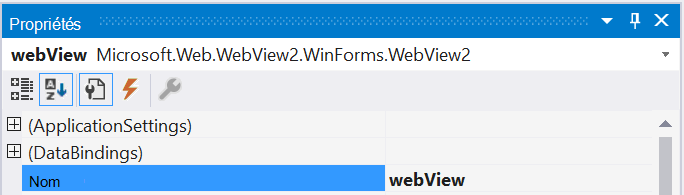

# <span data-ttu-id="c5725-104">Commencer à utiliser WebView2 dans les applications Windows Forms (Preview)</span><span class="sxs-lookup"><span data-stu-id="c5725-104">Getting Started with WebView2 in Windows Forms apps (Preview)</span></span>  

<span data-ttu-id="c5725-105">Dans cet article, vous allez commencer à créer votre première application WebView2 et à découvrir les principales fonctionnalités de [WebView2 (Preview)](/microsoft-edge/hosting/webview2/index).</span><span class="sxs-lookup"><span data-stu-id="c5725-105">In this article, get started creating your first WebView2 app and learn about the main features of [WebView2 (preview)](/microsoft-edge/hosting/webview2/index).</span></span>  <span data-ttu-id="c5725-106">Pour plus d’informations sur les API individuelles, voir informations de référence sur les [API](../reference/dotnet/0-9-515-reference-webview2.md).</span><span class="sxs-lookup"><span data-stu-id="c5725-106">For more information on individual APIs, see [API reference](../reference/dotnet/0-9-515-reference-webview2.md).</span></span>  

## <span data-ttu-id="c5725-107">Conditions préalables</span><span class="sxs-lookup"><span data-stu-id="c5725-107">Prerequisites</span></span>  

<span data-ttu-id="c5725-108">Vérifiez que vous avez installé la liste des conditions préalables suivantes avant de continuer:</span><span class="sxs-lookup"><span data-stu-id="c5725-108">Ensure you installed the following list of pre-requisites before proceeding:</span></span>  

* <span data-ttu-id="c5725-109">[Microsoft Edge (chrome)](https://www.microsoftedgeinsider.com/download/) installé sur Windows 10, Windows 8,1 ou Windows 7.</span><span class="sxs-lookup"><span data-stu-id="c5725-109">[Microsoft Edge (Chromium)](https://www.microsoftedgeinsider.com/download/) installed on Windows 10, Windows 8.1, or Windows 7.</span></span>  <span data-ttu-id="c5725-110">L’équipe WebView Microsoft Edge recommande d’utiliser le canal Canaries.</span><span class="sxs-lookup"><span data-stu-id="c5725-110">The Microsoft Edge WebView team recommends using the Canary channel.</span></span>  
* <span data-ttu-id="c5725-111">[Visual Studio](https://visualstudio.microsoft.com/) 2015 ou version ultérieure.</span><span class="sxs-lookup"><span data-stu-id="c5725-111">[Visual Studio](https://visualstudio.microsoft.com/) 2015 or later.</span></span>

> [!NOTE]
> <span data-ttu-id="c5725-112">Si vous développez avec **Windows Forms .net Core 3,0 ou .net 5**, téléchargez [Visual Studio (Preview)](https://visualstudio.microsoft.com/vs/preview/) .</span><span class="sxs-lookup"><span data-stu-id="c5725-112">If developing with **Windows Forms .NET Core 3.0 or .NET 5**, download [Visual Studio (Preview)](https://visualstudio.microsoft.com/vs/preview/)</span></span>

## <span data-ttu-id="c5725-113">Étape 1: créer une application de fenêtre unique</span><span class="sxs-lookup"><span data-stu-id="c5725-113">Step 1 - Create a single window application</span></span>

<span data-ttu-id="c5725-114">Utiliser un projet de bureau de base contenant une seule fenêtre principale.</span><span class="sxs-lookup"><span data-stu-id="c5725-114">Start with a basic desktop project containing a single main window.</span></span>  

1. <span data-ttu-id="c5725-115">Ouvrez **Visual Studio.**</span><span class="sxs-lookup"><span data-stu-id="c5725-115">Open **Visual Studio.**</span></span>

2. <span data-ttu-id="c5725-116">Choisissez **application .NET Framework pour Windows Forms** ou **application .net pour Windows Forms**, puis cliquez sur **suivant**.</span><span class="sxs-lookup"><span data-stu-id="c5725-116">Choose **Windows Forms .NET Framework App** or **Windows Forms .NET Core App**, and then choose **Next**.</span></span>

    

3. <span data-ttu-id="c5725-118">Entrez des valeurs pour le nom et l' **emplacement**du **projet** .</span><span class="sxs-lookup"><span data-stu-id="c5725-118">Enter values for **Project name** and **Location**.</span></span>  <span data-ttu-id="c5725-119">Sélectionnez **.NET Framework 4.6.2** ou version ultérieure, ou **.net Core 3,0** ou version ultérieure.</span><span class="sxs-lookup"><span data-stu-id="c5725-119">Select **.NET Framework 4.6.2** or later, or **.NET Core 3.0** or later.</span></span>  

    

4. <span data-ttu-id="c5725-121">Sélectionnez **créer** pour créer votre projet.</span><span class="sxs-lookup"><span data-stu-id="c5725-121">Choose **Create** to create your project.</span></span>

## <span data-ttu-id="c5725-122">Étape 2: installer le SDK WebView2</span><span class="sxs-lookup"><span data-stu-id="c5725-122">Step 2 - Install WebView2 SDK</span></span>

<span data-ttu-id="c5725-123">Ajoutez ensuite le kit de développement logiciel (SDK) WebView2 au projet.</span><span class="sxs-lookup"><span data-stu-id="c5725-123">Next add the WebView2 SDK to the project.</span></span>  <span data-ttu-id="c5725-124">Pour obtenir un aperçu, installez le kit de développement logiciel (SDK) WebView2 avec NuGet.</span><span class="sxs-lookup"><span data-stu-id="c5725-124">For the preview, install the WebView2 SDK using Nuget.</span></span>  

1. <span data-ttu-id="c5725-125">Ouvrez le menu contextuel du projet \ (cliquez avec le bouton droit sur \) et sélectionnez **gérer les packages NuGet...**.</span><span class="sxs-lookup"><span data-stu-id="c5725-125">Open the context menu on the project \(right-click\), and choose **Manage NuGet Packages...**.</span></span>  

    :::image type="complex" source="./media/wpf-gettingstarted-mngnuget.png" alt-text="NuGet":::
       <span data-ttu-id="c5725-127">NuGet</span><span class="sxs-lookup"><span data-stu-id="c5725-127">Nuget</span></span> :::image-end:::

2. <span data-ttu-id="c5725-128">Entrez `Microsoft.Web.WebView2` dans la barre de recherche.</span><span class="sxs-lookup"><span data-stu-id="c5725-128">Enter `Microsoft.Web.WebView2` in the search bar.</span></span>  <span data-ttu-id="c5725-129">Pour cela, sélectionnez **Microsoft. Web. WebView2** dans les résultats de recherche.</span><span class="sxs-lookup"><span data-stu-id="c5725-129">Choose **Microsoft.Web.WebView2** from the search results.</span></span>  <span data-ttu-id="c5725-130">Définissez la version du package sur **Pre-Release**, puis sélectionnez **installer**.</span><span class="sxs-lookup"><span data-stu-id="c5725-130">Set the package version to **pre-release**, and then choose **Install**.</span></span>  

    

<span data-ttu-id="c5725-132">Vous êtes prêt à commencer à développer des applications à l’aide de l’API WebView2.</span><span class="sxs-lookup"><span data-stu-id="c5725-132">You are all set to start developing applications using the WebView2 API.</span></span>  <span data-ttu-id="c5725-133">Sélectionnez `F5` pour générer et exécuter le projet.</span><span class="sxs-lookup"><span data-stu-id="c5725-133">Select `F5` to build and run the project.</span></span>  <span data-ttu-id="c5725-134">Le projet en cours d’exécution affiche une fenêtre vide.</span><span class="sxs-lookup"><span data-stu-id="c5725-134">The running project displays an empty window.</span></span>  


## <span data-ttu-id="c5725-136">Étape 3: créer un WebView unique</span><span class="sxs-lookup"><span data-stu-id="c5725-136">Step 3 - Create a single WebView</span></span>  

<span data-ttu-id="c5725-137">Ensuite, ajoutez un WebView à votre application.</span><span class="sxs-lookup"><span data-stu-id="c5725-137">Next add a WebView to your application.</span></span>  

1. <span data-ttu-id="c5725-138">Ouvrez le **Concepteur Windows Forms**.</span><span class="sxs-lookup"><span data-stu-id="c5725-138">Open the **Windows Forms Designer**.</span></span>  
2. <span data-ttu-id="c5725-139">Recherchez **WebView2** dans la **boîte à outils**.</span><span class="sxs-lookup"><span data-stu-id="c5725-139">Search for **WebView2** in the **Toolbox**.</span></span> <span data-ttu-id="c5725-140">Faites glisser et déposez le contrôle **WebView2** dans l’application Windows Forms</span><span class="sxs-lookup"><span data-stu-id="c5725-140">Drag and drop the **WebView2** control into the Windows Forms App</span></span>

    

3. <span data-ttu-id="c5725-142">Remplacez la `Name` propriété par `webView` .</span><span class="sxs-lookup"><span data-stu-id="c5725-142">Change the `Name` property to `webView`.</span></span>

    

4. <span data-ttu-id="c5725-144">La `Source` propriété définit l’URI initial affiché dans le contrôle WebView2.</span><span class="sxs-lookup"><span data-stu-id="c5725-144">The `Source` property sets the initial URI displayed in the WebView2 control.</span></span> <span data-ttu-id="c5725-145">Définissez la propriété source sur</span><span class="sxs-lookup"><span data-stu-id="c5725-145">Set the Source property to</span></span> <https://www.microsoft.com>

    

<span data-ttu-id="c5725-147">Sélectionnez `F5` pour générer et exécuter votre projet.</span><span class="sxs-lookup"><span data-stu-id="c5725-147">Select `F5` to build and run your project.</span></span>  <span data-ttu-id="c5725-148">Vérifiez que votre contrôle WebView2 s’affiche [https://www.microsoft.com](https://www.microsoft.com) .</span><span class="sxs-lookup"><span data-stu-id="c5725-148">Confirm that your WebView2 control displays [https://www.microsoft.com](https://www.microsoft.com).</span></span>


> [!NOTE]
> <span data-ttu-id="c5725-150">Si vous travaillez sur un moniteur haute résolution, il est possible que vous deviez [configurer votre application Windows Forms pour la prise en charge des résolutions élevées](https://docs.microsoft.com/dotnet/framework/winforms/high-dpi-support-in-windows-forms#configuring-your-windows-forms-app-for-high-dpi-support).</span><span class="sxs-lookup"><span data-stu-id="c5725-150">If you are working on a high DPI monitor, you may have to [configure your Windows Forms app for high DPI support](https://docs.microsoft.com/dotnet/framework/winforms/high-dpi-support-in-windows-forms#configuring-your-windows-forms-app-for-high-dpi-support).</span></span>

## <span data-ttu-id="c5725-151">Étape 4: gérer les événements de redimensionnement de la fenêtre</span><span class="sxs-lookup"><span data-stu-id="c5725-151">Step 4 - Handle Window Resize Events</span></span>

<span data-ttu-id="c5725-152">Ajoutez quelques contrôles supplémentaires à vos formulaires Windows à partir de la boîte à outils, puis gérez les événements de redimensionnement de fenêtre de manière appropriée.</span><span class="sxs-lookup"><span data-stu-id="c5725-152">Add a few more controls to your Windows Forms from the toolbox, and then handle window resize events appropriately.</span></span>

1. <span data-ttu-id="c5725-153">Dans le **Concepteur Windows Forms** , ouvrez la **boîte à outils**</span><span class="sxs-lookup"><span data-stu-id="c5725-153">In the **Windows Forms Designer** open the **Toolbox**</span></span>
2. <span data-ttu-id="c5725-154">Faites glisser et déposez un **contrôle TextBox** dans l’application Windows Forms.</span><span class="sxs-lookup"><span data-stu-id="c5725-154">Drag and Drop a **TextBox** into the Windows Forms App.</span></span> <span data-ttu-id="c5725-155">Nommez le **contrôle TextBox** `addressBar` dans l' **onglet Propriétés**.</span><span class="sxs-lookup"><span data-stu-id="c5725-155">Name the **TextBox** `addressBar` in the **Properties Tab**.</span></span>
3. <span data-ttu-id="c5725-156">Faites glisser et déposez un **bouton** dans l’application Windows Forms.</span><span class="sxs-lookup"><span data-stu-id="c5725-156">Drag and Drop a **Button** into the Windows Forms App.</span></span> <span data-ttu-id="c5725-157">Modifiez le texte du **bouton** `Go!` et nommez-le **Button** `goButton` dans l' **onglet Propriétés**.</span><span class="sxs-lookup"><span data-stu-id="c5725-157">Change the text in the **Button** to `Go!` and name the **Button** `goButton` in the **Properties Tab**.</span></span>

<span data-ttu-id="c5725-158">Dans le concepteur, l’application doit ressembler à ce qui suit:</span><span class="sxs-lookup"><span data-stu-id="c5725-158">The app should look like the following in the designer:</span></span>


4. <span data-ttu-id="c5725-160">Dans **Form1.cs** , définissez `Form_Resize` l’emplacement des contrôles lorsque la fenêtre de l’application est redimensionnée.</span><span class="sxs-lookup"><span data-stu-id="c5725-160">In **Form1.cs** define `Form_Resize` to keep the controls in place when the App Window is resized.</span></span>

```csharp
public Form1()
{
    InitializeComponent();
    this.Resize += new System.EventHandler(this.Form_Resize);
}

private void Form_Resize(object sender, EventArgs e)
{
    webView.Size = this.ClientSize - new System.Drawing.Size(webView.Location);
    goButton.Left = this.ClientSize.Width - goButton.Width;
    addressBar.Width = goButton.Left - addressBar.Left;
}
```

<span data-ttu-id="c5725-161">Sélectionnez `F5` pour générer et exécuter votre projet.</span><span class="sxs-lookup"><span data-stu-id="c5725-161">Select `F5` to build and run your project.</span></span>  <span data-ttu-id="c5725-162">Vérifiez que l’application s’affiche comme dans la capture d’écran suivante.</span><span class="sxs-lookup"><span data-stu-id="c5725-162">Confirm that the app displays similar to the following screenshot.</span></span>


## <span data-ttu-id="c5725-164">Étape 5: navigation</span><span class="sxs-lookup"><span data-stu-id="c5725-164">Step 5 - Navigation</span></span>

<span data-ttu-id="c5725-165">Ajoutez la possibilité d’autoriser les utilisateurs à modifier l’URL d’affichage du contrôle WebView2 en ajoutant une barre d’adresse à l’application.</span><span class="sxs-lookup"><span data-stu-id="c5725-165">Add the ability to allow users to change the URL that the WebView2 control displays by adding an address bar to the app.</span></span>

1. <span data-ttu-id="c5725-166">Dans `Form1.cs` Ajouter l' `CoreWebView2` espace de noms en insérant l’extrait de code suivant en haut de `Form1.cs` .</span><span class="sxs-lookup"><span data-stu-id="c5725-166">In `Form1.cs` add the `CoreWebView2` namespace by inserting the following code snippet at the top of `Form1.cs`.</span></span>  

    ```csharp
    using Microsoft.Web.WebView2.Core;
    ```

2. <span data-ttu-id="c5725-167">Dans le **Concepteur Windows Forms**, double-cliquez sur le `Go!` bouton pour créer la `goButton_Click` méthode `Form1.cs` .</span><span class="sxs-lookup"><span data-stu-id="c5725-167">In the **Windows Forms Designer**, double-click on the `Go!` button to create the `goButton_Click` method in `Form1.cs`.</span></span> <span data-ttu-id="c5725-168">Copiez et collez l’extrait de code suivant dans la fonction.</span><span class="sxs-lookup"><span data-stu-id="c5725-168">Copy and paste the following snippet inside the function.</span></span> <span data-ttu-id="c5725-169">À présent, la `goButton_Click` fonction navigue vers l’URL entrée dans la barre d’adresses de l’affichage.</span><span class="sxs-lookup"><span data-stu-id="c5725-169">Now, the `goButton_Click` function navigates the WebView to the URL entered in the address bar.</span></span>

    ```csharp
    private void goButton_Click(object sender, EventArgs e)
    {
        if (webView != null && webView.CoreWebView2 != null)
        {
            webView.CoreWebView2.Navigate(addressBar.Text);
        }
    }
    ```  

<span data-ttu-id="c5725-170">Sélectionnez `F5` pour générer et exécuter votre projet.</span><span class="sxs-lookup"><span data-stu-id="c5725-170">Select `F5` to build and run your project.</span></span>  <span data-ttu-id="c5725-171">Entrez une nouvelle URL dans la barre d’adresses, puis cliquez sur **atteindre**.</span><span class="sxs-lookup"><span data-stu-id="c5725-171">Enter a new URL in the address bar, and click **Go**.</span></span>  <span data-ttu-id="c5725-172">Par exemple, entrez `https://www.bing.com` .</span><span class="sxs-lookup"><span data-stu-id="c5725-172">For example, enter `https://www.bing.com`.</span></span>  <span data-ttu-id="c5725-173">Vérifiez que le contrôle WebView2 accède à l’URL.</span><span class="sxs-lookup"><span data-stu-id="c5725-173">Confirm that the WebView2 control navigates to the URL.</span></span>  

> [!NOTE]
> <span data-ttu-id="c5725-174">Vérifiez qu’une URL complète est entrée dans la barre d’adresses.</span><span class="sxs-lookup"><span data-stu-id="c5725-174">Ensure a complete URL is entered in the address bar.</span></span> <span data-ttu-id="c5725-175">`ArgumentException`A est levé si l’URL ne commence pas par `http://` ou</span><span class="sxs-lookup"><span data-stu-id="c5725-175">An `ArgumentException` is thrown if the URL does not start with `http://` or</span></span> `https://`


## <span data-ttu-id="c5725-177">Étape 6: événements de navigation</span><span class="sxs-lookup"><span data-stu-id="c5725-177">Step 6 - Navigation events</span></span>  

<span data-ttu-id="c5725-178">L’application qui héberge les contrôles WebView2 écoute les événements suivants qui sont déclenchés par le contrôle WebView2 lors de la navigation dans les pages Web.</span><span class="sxs-lookup"><span data-stu-id="c5725-178">The application that hosts WebView2 controls listens to the following events that are raised by the WebView2 control during navigation to web pages.</span></span>  

* `NavigationStarting`  
* `SourceChanged`  
* `ContentLoading`  
* `HistoryChanged`  
* `NavigationCompleted`  

<span data-ttu-id="c5725-179">Pour plus d’informations, voir [événements de navigation](../reference/win32/0-9-488/icorewebview2.md#navigation-events).</span><span class="sxs-lookup"><span data-stu-id="c5725-179">For more information, see [Navigation Events](../reference/win32/0-9-488/icorewebview2.md#navigation-events).</span></span>  

:::image type="complex" source="../media/navigation-events.png" alt-text="Événements de navigation":::
   <span data-ttu-id="c5725-181">Événements de navigation</span><span class="sxs-lookup"><span data-stu-id="c5725-181">Navigation events</span></span>
:::image-end:::

<span data-ttu-id="c5725-182">Lorsqu’une erreur se produit, les événements suivants sont déclenchés et peut dépendre de la navigation sur une page d’erreur.</span><span class="sxs-lookup"><span data-stu-id="c5725-182">When an error occurs, the following events are raised and may depend on navigation to an error page.</span></span>  

* `SourceChanged`  
* `ContentLoading`  
* `HistoryChanged`  

<span data-ttu-id="c5725-183">S’il existe une redirection HTTP, il existe plusieurs `NavigationStarting` événements.</span><span class="sxs-lookup"><span data-stu-id="c5725-183">When there is an HTTP redirect, there are multiple `NavigationStarting` events.</span></span>  

<span data-ttu-id="c5725-184">Pour illustrer l’utilisation de ces événements, commencez par enregistrer un gestionnaire pour `NavigationStarting` cela annule toutes les demandes qui n’utilisent pas HTTPS.</span><span class="sxs-lookup"><span data-stu-id="c5725-184">To demonstrate how to use these events, start by registering a handler for `NavigationStarting` that cancels any requests that do not use HTTPS.</span></span>  

<span data-ttu-id="c5725-185">Dans `Form1.cs` , modifiez le constructeur comme illustré ci-dessous, puis ajoutez la `EnsureHttps` fonction.</span><span class="sxs-lookup"><span data-stu-id="c5725-185">In `Form1.cs`, modify the constructor as shown below and add the `EnsureHttps` function.</span></span>  

```csharp
public Form1()
{
    InitializeComponent();
    this.Resize += new System.EventHandler(this.Form_Resize);

    webView.NavigationStarting += EnsureHttps;
}

void EnsureHttps(object sender, CoreWebView2NavigationStartingEventArgs args)
{
    String uri = args.Uri;
    if (!uri.StartsWith("https://"))
    {
        args.Cancel = true;
    }
}
```

<span data-ttu-id="c5725-186">Dans le constructeur, EnsureHttps est enregistré en tant que gestionnaire d’événements sur l' `NavigationStarting` événement sur le contrôle WebView2.</span><span class="sxs-lookup"><span data-stu-id="c5725-186">In the constructor, EnsureHttps is registered as the event handler on the `NavigationStarting` event on the WebView2 control.</span></span>  

<span data-ttu-id="c5725-187">Sélectionnez `F5` pour générer et exécuter votre projet.</span><span class="sxs-lookup"><span data-stu-id="c5725-187">Select `F5` to build and run your project.</span></span> <span data-ttu-id="c5725-188">Confirmez que lorsque vous naviguez vers un site HTTP, le WebView reste inchangé.</span><span class="sxs-lookup"><span data-stu-id="c5725-188">Confirm that when navigating to an HTTP site, the WebView remains unchanged.</span></span> <span data-ttu-id="c5725-189">Toutefois, le WebView accède aux sites HTTPs.</span><span class="sxs-lookup"><span data-stu-id="c5725-189">However, the WebView will navigate to HTTPS sites.</span></span>

## <span data-ttu-id="c5725-190">Étape 7: création de scripts</span><span class="sxs-lookup"><span data-stu-id="c5725-190">Step 7 - Scripting</span></span>  

<span data-ttu-id="c5725-191">Vous pouvez utiliser des applications hôtes pour injecter du code JavaScript dans les contrôles WebView2 lors de l’exécution.</span><span class="sxs-lookup"><span data-stu-id="c5725-191">You may use host applications to inject JavaScript code into WebView2 controls at runtime.</span></span>  <span data-ttu-id="c5725-192">Le JavaScript injecté s’applique à tous les nouveaux documents de niveau supérieur ainsi qu’à toute image enfant jusqu’à ce que le JavaScript soit supprimé.</span><span class="sxs-lookup"><span data-stu-id="c5725-192">The injected JavaScript applies to all new top level documents and any child frames until the JavaScript is removed.</span></span>  <span data-ttu-id="c5725-193">Le JavaScript injecté est exécuté après la création de l’objet global et avant l’exécution de tout autre script inclus dans le document HTML.</span><span class="sxs-lookup"><span data-stu-id="c5725-193">The injected JavaScript is run after creation of the global object, and before any other script included in the HTML document is run.</span></span>  

<span data-ttu-id="c5725-194">Vous pouvez utiliser les scripts pour alerter l’utilisateur lorsque vous naviguez vers un site non HTTPs.</span><span class="sxs-lookup"><span data-stu-id="c5725-194">You can use scripting to alert the user when navigating to a non-HTTPS site.</span></span>  <span data-ttu-id="c5725-195">Modifiez la `EnsureHttps` fonction de telle sorte qu’elle injecte le script dans le contenu Web à l’aide de la méthode [ExecuteScriptAsync]() .</span><span class="sxs-lookup"><span data-stu-id="c5725-195">Modify the `EnsureHttps` function so that it injects script into the web content using the [ExecuteScriptAsync]() method.</span></span>  

```csharp
void EnsureHttps(object sender, CoreWebView2NavigationStartingEventArgs args)
{
    String uri = args.Uri;
    if (!uri.StartsWith("https://"))
    {
        webView.CoreWebView2.ExecuteScriptAsync($"alert('{uri} is not safe, try an https link')");
        args.Cancel = true;
    }
}
```  

<span data-ttu-id="c5725-196">Sélectionnez `F5` pour générer et exécuter votre projet.</span><span class="sxs-lookup"><span data-stu-id="c5725-196">Select `F5` to build and run your project.</span></span>  <span data-ttu-id="c5725-197">Vérifiez que l’application affiche une alerte lorsque vous naviguez vers un site qui n’utilise pas HTTPs.</span><span class="sxs-lookup"><span data-stu-id="c5725-197">Confirm that the application displays an alert when you navigate to a site that does not use HTTPS.</span></span>  


## <span data-ttu-id="c5725-199">Étape 8: communication entre l’hôte et le contenu Web</span><span class="sxs-lookup"><span data-stu-id="c5725-199">Step 8 - Communication between host and web content</span></span>  

<span data-ttu-id="c5725-200">L’hôte et le contenu Web sont en mesure de communiquer entre eux `postMessage` comme suit:</span><span class="sxs-lookup"><span data-stu-id="c5725-200">The host and web content may communicate with each other using `postMessage` as follows:</span></span>  

* <span data-ttu-id="c5725-201">Le contenu Web d’un contrôle WebView2 risque de publier un message destiné à l’hôte à l’aide de `window.chrome.webview.postMessage` .</span><span class="sxs-lookup"><span data-stu-id="c5725-201">Web content in a WebView2 control may post a message to the host using `window.chrome.webview.postMessage`.</span></span>  <span data-ttu-id="c5725-202">L’hôte gère le message en utilisant tout inscrit `WebMessageReceived` sur l’hôte.</span><span class="sxs-lookup"><span data-stu-id="c5725-202">The host handles the message using any registered `WebMessageReceived` on the host.</span></span>  
* <span data-ttu-id="c5725-203">Héberge les messages dans le contenu Web d’un contrôle WebView2 en utilisant `CoreWebView2.PostWebMessageAsString` ou `CoreWebView2.PostWebMessageAsJSON` .</span><span class="sxs-lookup"><span data-stu-id="c5725-203">Hosts post messages to web content in a WebView2 control using `CoreWebView2.PostWebMessageAsString` or `CoreWebView2.PostWebMessageAsJSON`.</span></span>  <span data-ttu-id="c5725-204">Ces messages sont interceptés par des gestionnaires ajoutés à `window.chrome.webview.addEventListener` .</span><span class="sxs-lookup"><span data-stu-id="c5725-204">These messages are caught by handlers added to `window.chrome.webview.addEventListener`.</span></span>  

<span data-ttu-id="c5725-205">Ce mécanisme de communication permet au contenu Web de transmettre des messages à l’hôte à l’aide de fonctionnalités natives.</span><span class="sxs-lookup"><span data-stu-id="c5725-205">This communication mechanism allows web content to pass messages to the host using native capabilities.</span></span>  

<span data-ttu-id="c5725-206">Dans votre projet, lorsque le contrôle WebView2 navigue vers une URL, il affiche l’URL dans la barre d’adresse et avertit l’utilisateur de l’URL qui s’affiche dans le contrôle WebView2.</span><span class="sxs-lookup"><span data-stu-id="c5725-206">In your project, when the WebView2 control navigates to a URL, it displays the URL in the address bar and alerts the user of the URL displayed in the WebView2 control.</span></span>  

1. <span data-ttu-id="c5725-207">Dans **Form1.cs**, mettez à jour votre constructeur et créez une `InitializeAsync` fonction comme illustré dans l’extrait de code suivant.</span><span class="sxs-lookup"><span data-stu-id="c5725-207">In **Form1.cs**, update your constructor and create an `InitializeAsync` function as shown in the following code snippet.</span></span>  <span data-ttu-id="c5725-208">La `InitializeAsync` fonction est en attente [EnsureCoreWebView2Async]() , car l’initialisation de `CoreWebView2` est asynchrone.</span><span class="sxs-lookup"><span data-stu-id="c5725-208">The `InitializeAsync` function awaits [EnsureCoreWebView2Async]() because the initialization of `CoreWebView2` is asynchronous.</span></span>  

    ```csharp
    public Form1()
    {
        InitializeComponent();
        this.Resize += new System.EventHandler(this.Form_Resize);
        webView.NavigationStarting += EnsureHttps;
        InitializeAsync();
    }

    async void InitializeAsync()
    {
        await webView.EnsureCoreWebView2Async(null);
    }
    ```  

2. <span data-ttu-id="c5725-209">Une fois **CoreWebView2** initialisé, inscrivez un gestionnaire d’événements pour y répondre `WebMessageReceived` .</span><span class="sxs-lookup"><span data-stu-id="c5725-209">After **CoreWebView2** is initialized, register an event handler to respond to `WebMessageReceived`.</span></span>  <span data-ttu-id="c5725-210">Dans `Form1.cs` Update `InitializeAsync` et ajoutez `UpdateAddressBar` à l’aide de l’extrait de code suivant.</span><span class="sxs-lookup"><span data-stu-id="c5725-210">In `Form1.cs` update `InitializeAsync` and add `UpdateAddressBar` using the following code snippet.</span></span>  

    ```csharp
    async void InitializeAsync()
    {
        await webView.EnsureCoreWebView2Async(null);
        webView.CoreWebView2.WebMessageReceived += UpdateAddressBar;
    }

    void UpdateAddressBar(object sender, CoreWebView2WebMessageReceivedEventArgs args)
    {
        String uri = args.TryGetWebMessageAsString();
        addressBar.Text = uri;
        webView.CoreWebView2.PostWebMessageAsString(uri);
    }
    ```  

3. <span data-ttu-id="c5725-211">Pour que le WebView envoie le message électronique et y réponde, une fois `CoreWebView2` initialisé, l’hôte injecte un script dans le contenu Web pour:</span><span class="sxs-lookup"><span data-stu-id="c5725-211">In order for the WebView to send and respond to the web message, after `CoreWebView2` is initialized, the host injects a script in the web content to:</span></span>  

    1. <span data-ttu-id="c5725-212">Envoyez l’URL à l’hôte à l’aide de `postMessage` .</span><span class="sxs-lookup"><span data-stu-id="c5725-212">Send the URL to the host using `postMessage`.</span></span>
    2. <span data-ttu-id="c5725-213">Enregistrez un gestionnaire d’événements pour imprimer un message envoyé à partir de l’hôte.</span><span class="sxs-lookup"><span data-stu-id="c5725-213">Register an event handler to print a message sent from the host.</span></span>  

<span data-ttu-id="c5725-214">Dans `Form1.cs` la mise à jour, `InitializeAsync` procédez comme indiqué dans l’extrait de code suivant.</span><span class="sxs-lookup"><span data-stu-id="c5725-214">In `Form1.cs`, update `InitializeAsync` as shown in the following code snippet.</span></span>  

```csharp
async void InitializeAsync()
{
    await webView.EnsureCoreWebView2Async(null);
    webView.CoreWebView2.WebMessageReceived += UpdateAddressBar;

    await webView.CoreWebView2.AddScriptToExecuteOnDocumentCreatedAsync("window.chrome.webview.postMessage(window.document.URL);");
    await webView.CoreWebView2.AddScriptToExecuteOnDocumentCreatedAsync("window.chrome.webview.addEventListener(\'message\', event => alert(event.data));");
}
```  

<span data-ttu-id="c5725-215">Sélectionnez `F5` pour générer et exécuter l’application.</span><span class="sxs-lookup"><span data-stu-id="c5725-215">Select `F5` to build and run the app.</span></span>  <span data-ttu-id="c5725-216">Vérifiez que la barre d’adresse affiche l’URL du site affiché dans le WebView.</span><span class="sxs-lookup"><span data-stu-id="c5725-216">Confirm that the address bar displays the URL of the site displayed in the WebView.</span></span> <span data-ttu-id="c5725-217">Par ailleurs, lorsque vous accédez à une nouvelle URL, le WebView avertit l’utilisateur de l’URL affichée dans le WebView.</span><span class="sxs-lookup"><span data-stu-id="c5725-217">Also, when you successfully navigate to a new URL, the WebView alerts the user of the URL displayed in the WebView.</span></span>  


<span data-ttu-id="c5725-219">Félicitations, vous avez créé votre première application WebView2.</span><span class="sxs-lookup"><span data-stu-id="c5725-219">Congratulations, you built your first WebView2 app!</span></span>  

## <span data-ttu-id="c5725-220">Étapes suivantes</span><span class="sxs-lookup"><span data-stu-id="c5725-220">Next Steps</span></span>  

<span data-ttu-id="c5725-221">Pour plus d’informations sur les fonctionnalités d’WebView2 non traitées dans cette procédure pas à pas, voir la référence de l' [API](../reference/dotnet/0-9-515-reference-webview2.md).</span><span class="sxs-lookup"><span data-stu-id="c5725-221">For more information on WebView2 features not covered in this walkthrough, see the [API reference](../reference/dotnet/0-9-515-reference-webview2.md).</span></span>

## <span data-ttu-id="c5725-222">Contacter l’équipe WebView de Microsoft Edge</span><span class="sxs-lookup"><span data-stu-id="c5725-222">Getting in touch with the Microsoft Edge WebView team</span></span>  

<span data-ttu-id="c5725-223">Aidez-vous à créer une expérience WebView2 plus riche en partageant vos commentaires!</span><span class="sxs-lookup"><span data-stu-id="c5725-223">Help build a richer WebView2 experience by sharing your feedback!</span></span>  <span data-ttu-id="c5725-224">Visitez le site Web Microsoft Edge [référentiel Samples](https://aka.ms/webviewfeedback) pour envoyer des demandes de fonctionnalité ou des rapports de bogues, ou pour rechercher des problèmes connus.</span><span class="sxs-lookup"><span data-stu-id="c5725-224">Visit the Microsoft Edge WebView [feedback repo](https://aka.ms/webviewfeedback) to submit feature requests or bug reports or search for known issues.</span></span>  
